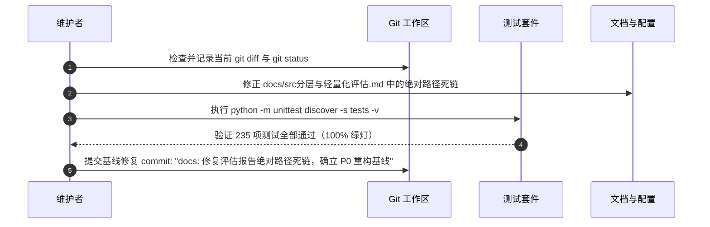

# 重构实施步骤 0：基线固化与测试准备（P0 · Baseline）

> **文档标识**：`docs/refactor/01-P0-基线固化与测试准备.md`  
> **所属批次**：P0 准备阶段  
> **前置依赖**：无  
> **后续步骤**：[P1 · 定向查找边界与行为修复](./02-P1-定向查找边界与行为修复.md)

---

## 1. 步骤定位与目标

本步骤为分层重构的**前置准备与安全防线**。核心原则是：**在进行任何源码修改之前，固化当前所有运行时参数、隔离测试数据、建立可重复运行的对比基准**。

### 1.1 核心目标
1. **工作区状态基线化**：记录当前未提交的代码变更与关键运行参数，确立不可回退的技术指标。
2. **测试数据自包含化**：将此前离线评估时引用的外部测试探针与固定样本规范化移入仓库内 `tests/fixtures/`，彻底消除测试对外部绝对路径的依赖（顺带修复 `test_docs.py` 中的失效链接问题）。
3. **隔离数据沙箱**：建立测试环境与正式资产（`data/catalog.json`、`data/local/pool.json`）之间的隔离机制，确保后续重构测试不会意外覆盖真实生产数据。
4. **梳理外部契约调用清单**：整理所有外部脚本、CLI、GitHub Actions 与 IDE 运行配置的调用入口，作为后续迁移时的变更清单。

---

## 2. 运行时基准参数冻结表

在本次重构中，以下参数为**固定基准**，后续任何重构、分拆与参数迁移均不得私自回退：

| 配置项 | 生效值 | 所在位置 | 冻结说明 |
| :--- | :--- | :--- | :--- |
| **查询规划输出 Token 上限** | `4,000` | `skill_finder.py` (常量 `PLAN_MAX_OUTPUT_TOKENS`) | 保留，严禁恢复旧方案的 1,200 |
| **单技能评估输出 Token 上限** | `10,000` | `skill_finder.py` (常量 `EVAL_MAX_OUTPUT_TOKENS`) | 保留，严禁恢复旧方案的 2,500 |
| **连续模型失败停止阈值** | `20` | `skill_finder.py` (常量 `MAX_CONSECUTIVE_FAILURES`) | 保留，提取为有命名的共享常量，严禁重置为 3 |
| **定向查找最大候选评估数** | `80` | `config/find-skill.json` (`max_evaluations`) | 配置文件覆盖代码默认值，保持 80 |
| **定向查找总 Token 熔断上限** | `"20 000 000"` (20M) | `config/find-skill.json` (`max_tokens`) | 解释为 20,000,000，支持格式化分隔符 |
| **本地运行目标推荐数** | `50` | `config/local-run.json` (`target_recommended`) | 本地模式的目标产出数 |
| **本地运行总 Token 上限** | `100,000,000` (100M) | `config/local-run.json` (`max_total_tokens`) | 保持 100M 预算熔断 |
| **网络异常最大重试次数** | `5` | `config/local-run.json` (`max_retries`) | 遇网络错误或 429/5xx 重试 5 次（首+重=6次） |
| **候选池安全水位线** | `20` | `config/local-run.json` (`pool_watermark`) | 池内待处理候选 >= 20 时秒级跳过网络搜索 |

---

## 3. 探针数据自包含化与测试修复

### 3.1 现状问题诊断
当前运行 `python -m unittest discover -s tests` 时，存在唯一失败：
* **失败用例**：`test_docs.DocLinkTest.test_all_local_links_resolve`
* **原因分析**：`docs/src分层与轻量化评估.md` 第 324-326 行引用了某台机器上的绝对路径：
  ```markdown
  - [可重复运行的离线探针](C:/Users/Administrator/.codex/visualizations/.../architecture_probes.py)
  - [探针结果](C:/Users/Administrator/.codex/visualizations/.../architecture_probe_results.json)
  - [规模与依赖数据](C:/Users/Administrator/.codex/visualizations/.../architecture_metrics.json)
  ```
  文档测试将其当作本地相对链接校验，导致报错。

### 3.2 治理方案
1. 将上述 Markdown 超链接改为纯代码文本（行内反引号），消除虚假本地链接。
2. 将离线探针中沉淀出的典型边界样本（假引文、截断 Markdown、空响应、跨行伪造）转存至 `tests/fixtures/finder_samples/` 目录下，作为 P1 步骤自动化测试的现成测试夹具。

---

## 4. 外部契约与调用点清单

重构过程中必须确保以下对外调用入口保持兼容，不得破坏参数契约与退出行为：

### 4.1 命令行入口（CLI）
1. `python tools/run_local.py`
   * 支持 `--check`（仅离线预检，0 消费、0 网络、0 写入）。
   * 支持 `--sync-config`（离线同步 overrides.json 和 snoozed.json 到 catalog.json，0 Token）。
   * 支持 `--enrich-catalog`（离线结构化增强，0 Token）。
   * 支持 `--refresh-pool`、`--target`、`--max-evaluations` 等参数。
2. `python tools/find_skill.py [topic]`
   * 支持位置参数传 `topic`，支持在交互终端提示输入。
   * 支持 `--limit`、`--max-evaluations`、`--max-tokens` 命令行覆盖。
3. `python -m src.pipeline`
   * 必须保留完整的参数接口：`--phase reserve|evaluate|all`、`--dry-run`、`--json`、`--config-dir`、`--data-dir`、`--public-dir`。

### 4.2 GitHub Actions 脚本片段
1. `.github/workflows/sync-skills.yml`：
   * 包含内联 Python 执行：`python -c 'from src.budget import week_id; print(week_id())'`。
   * **迁移注意**：后续 `week_id` 迁移至 `src/shared/runtime.py` 或 `src/catalog/budget.py` 时，必须同步修改该 YAML 文件或保留顶层导出兼容。
2. `.github/workflows/sync-config-deploy.yml`：
   * 调用：`python tools/run_local.py --sync-config`。
3. `.github/workflows/deploy-pages.yml`：
   * 仅打包上传 `public/` 产物，不依赖后端代码。

### 4.3 IDE 与辅助脚本
1. `.run/Local Skills - 50 recommended.run.xml`：通过 PyCharm 直接执行 `tools/run_local.py`。
2. `scripts/preview.ps1`：启动本地 HTTP 服务预览 `public/`。
3. `scripts/run-local.ps1`：PowerShell 批量运行入口。

---

## 5. P0 具体实施动作步骤



### 操作 1：修正文档死链
修改 `docs/src分层与轻量化评估.md` 末尾的探针链接，将其由超链接改为纯文本展示：
```markdown
- 可重复运行的离线探针：`architecture_probes.py`
- 探针结果：`architecture_probe_results.json`
- 规模与依赖数据：`architecture_metrics.json`
```

### 操作 2：运行全量回归
在项目根目录下执行：
```powershell
.\.venv\Scripts\python.exe -m unittest discover -s tests -v
```
**期望结果**：`Ran 235 tests in ...s - OK`，全量测试 100% 通过。

### 操作 3：固化快照提交
使用明确的提交信息提交该基线：
```powershell
git add docs/src分层与轻量化评估.md
git commit -m "docs: 修复评估报告死链并固化重构前测试基线 (P0)"
```

---

## 6. P0 验收检查清单

- [ ] 当前工作区干净，所有基准参数已记录确认。
- [ ] `docs/src分层与轻量化评估.md` 中的链接错误已修复。
- [ ] 现有 235 项单元与集成测试全部通过（0 失败，0 错误）。
- [ ] 外部契约与 Actions 调用点清单已核对，知晓后续改动受影响的文件。
- [ ] **满足上述所有条件后，方可进入 P1 阶段**。
