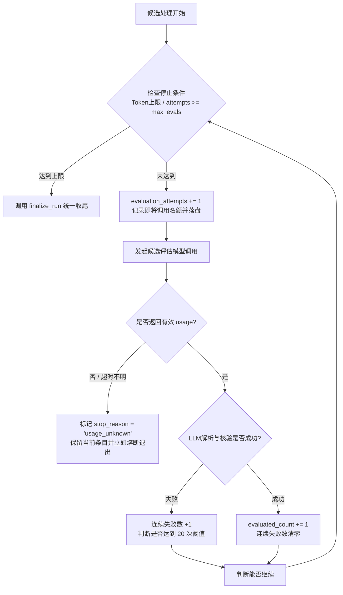

# 重构实施步骤 1：定向查找边界与行为修复（P1 · Bugfix First）

> **文档标识**：`docs/refactor/02-P1-定向查找边界与行为修复.md`  
> **所属批次**：P1 缺陷修复与防线建立  
> **前置依赖**：[P0 · 基线固化与测试准备](./01-P0-基线固化与测试准备.md)  
> **后续步骤**：[P2 · 提取共享数据与外部接口](./03-P2-提取共享数据与外部接口.md)

---

## 1. 步骤定位与目标

本步骤坚持**“先修业务缺陷，再做代码搬迁”**的原则。在当前目录结构未发生大重组之前，直接在 `src/skill_finder.py` 和 `src/find_evaluate.py` 中彻底修复离线评估中暴露出的 **5 大核心缺陷（F1～F5）**，并通过新增专用测试将其锁定。

### 1.1 核心修复目标
1. **F1 记账与熔断**：区分尝试次数与成功数；未知用量/超时立即熔断停机。
2. **F2 证据严格核验**：废除模糊与反向匹配，杜绝虚假证据评定为 `strong`。
3. **F3 单一退出收尾**：统一收尾函数，规范 CLI 退出码，消除中断后丢短名单的缺陷。
4. **F4 轮转与反截断**：实现查询轮转去重与多路径交替提取，basename 必须为 `SKILL.md`。
5. **F5 参数防御校验**：配置优先级明确，非法参数直接报错退出，不静默吞错。

---

## 2. 涉及文件与改动范围

* **待修改文件**：
  * `src/skill_finder.py`：重构记账循环、统一收尾、调度轮转、参数校验。
  * `src/find_evaluate.py`：重构证据核验逻辑、废除模糊匹配、禁止准则类型私自升级。
* **待新增测试文件**：
  * `tests/test_skill_finder.py`：覆盖用量停止、名额占用、轮转调度、退出码与收尾逻辑。
  * `tests/test_find_evaluate.py`：覆盖严格路径/行号/引文比对、降级规则、反幻觉用例。

---

## 3. 五大行为修复技术规范（F1 ～ F5）

### 3.1 F1：请求记账、评估名额与用量熔断

#### 痛点复盘
原代码使用 `len(evaluated_items)` 约束 `max_evaluations`，导致解析失败或请求失败时不计入配额，实际上发起了超额请求；且规划或评估缺少 usage 时，循环仍继续运行。

#### 规范设计
在 `skill_finder.py` 中严格维护三组独立计数器：

```python
# 1. 候选评估尝试数：只要发起了候选评估调用，无论成功、失败均加 1
evaluation_attempts: int = 0

# 2. 成功评估数：成功完成 LLM 调用、JSON 解析与证据核验的候选数
evaluated_count: int = 0

# 3. 模型请求总数：底层实际发生的 HTTP 请求次数（包含规划调用）
total_model_requests: int = usage_totals.requests
```

#### 熔断与调度状态流转


1. **先占名额后请求**：调用模型前，立即将该候选标记为占位，`evaluation_attempts += 1` 并更新状态文件。
2. **未知用量零容忍**：规划或单条评估若 `call.usage` 缺失或返回超时，**立即停止后续付费请求**，保留已有有效结果，以 `usage_unknown` 状态安全退出。
3. **连续失败熔断**：连续模型错误达 20 次强制停止。

---

### 3.2 F2：代码级证据严格核验（彻底消灭幻觉）

#### 痛点复盘
原代码允许引文前 20 字符或后 20 字符匹配，允许反向包含。模型即便捏造了第 99999 行或在真实句子后拼接虚假承诺，也能被判定为有效。

#### 规范设计
在 `src/find_evaluate.py` 的 `verify_and_adjust_evaluation()` 中执行严格的**“三重精确核验”**：

```python
def verify_evidence(quote: dict, materials: dict[str, str]) -> tuple[bool, str]:
    """严格核验单条引文证据：
    1. 路径必须完全一致（规范化路径，不允许多余前缀或跨文件）
    2. 行号必须在材料有效行范围内（1 <= start_line <= end_line <= total_lines）
    3. 行号区间内必须精确包含引文文本（支持换行与连续空白标准化，但不允许删改文字）
    """
    file_path = quote.get("file", "").strip()
    if file_path not in materials:
        return False, f"引用的文件未在已读取材料中找到: {file_path}"
    
    text = materials[file_path]
    lines = text.splitlines()
    total_lines = len(lines)
    
    start_line = quote.get("start_line")
    end_line = quote.get("end_line")
    
    if not (isinstance(start_line, int) and isinstance(end_line, int)):
        return False, "行号必须为整数"
    if not (1 <= start_line <= end_line <= total_lines):
        return False, f"行号范围越界: [{start_line}, {end_line}]，文件共 {total_lines} 行"
    
    # 提取行号区间内的实际文本并规范化
    target_block = " ".join(lines[start_line - 1 : end_line])
    normalized_block = re.sub(r"\s+", " ", target_block)
    
    quote_text = quote.get("text", "")
    normalized_quote = re.sub(r"\s+", " ", quote_text)
    
    if not normalized_quote or normalized_quote not in normalized_block:
        return False, "指定行号区间内未找到完整匹配的引文内容"
        
    return True, "核验通过"
```

#### 降级与强匹配门槛
* **证据降级**：若模型声称 `status == "supported"`，但其引文核验未通过，**强制将该准则降级为 `unknown`**，并将其匹配度降为 `none`。
* **`strong` 评定门槛**：只有当规划中所有的 `required`（必需准则）全部为 `supported` 且**证据全部核验通过**时，条目总匹配度才允许为 `strong`；否则最高只能评为 `partial`。

---

### 3.3 F3：单一退出收尾与规范退出码

#### 痛点复盘
各异常分支（429 报错、用户 Ctrl+C 中断、达到 Token 限额）散落退出，导致生成的报告中短名单为空，且退出码与事实不符。

#### 规范设计
引入中心化收尾函数 `finalize_run(state, stop_reason)`：

```python
def finalize_run(run_state: FinderRunState, stop_reason: str) -> dict:
    """所有退出路径必须统一流经本函数：
    1. 无论何种停止原因，只要存在已评估候选，重新执行 rank_find_results()
    2. 生成规范的 shortlist（短名单）与 alternatives（备选）
    3. 生成 Markdown 与 JSON 报告并持久化
    4. 映射规范的进程退出码
    """
    run_state.stop_reason = stop_reason
    run_state.completed_at = now_local().isoformat()
    
    # 基于所有成功评估条目重新排名
    shortlist, alternatives = rank_find_results(
        run_state.evaluated_items, 
        limit=run_state.params["limit"]
    )
    run_state.shortlist = shortlist
    run_state.alternatives = alternatives
    
    # 持久化本地报告
    save_run_reports(run_state)
    return run_state.to_dict()
```

#### CLI 进程退出码规范对照表
| 场景 | `status` | `stop_reason` | 退出码 | 说明 |
| :--- | :--- | :--- | :---: | :--- |
| **正常完成** | `completed` | `target_reached` / `candidates_exhausted` | **0** | 搜集满额或候选自然耗尽 |
| **配额/预算停止** | `stopped` | `token_limit` / `evaluation_limit` | **2** | 达到 Token 上限或评估数上限 |
| **异常熔断** | `stopped` | `usage_unknown` / `model_failures` | **2** | 用量缺失熔断或连续 20 次失败 |
| **基础设施失败** | `error` | `search_failed` / `plan_failed` | **1** | GitHub 全部 429、网络全断或规划异常 |
| **用户主动中断** | `interrupted`| `interrupted` | **130** | 捕获 KeyboardInterrupt (Ctrl+C) |
| **启动参数错误** | 无法启动 | `invalid_config` / `invalid_argument` | **2** | 启动校验失败，不调用模型 |

---

### 3.4 F4：查询与候选公平轮转防截断

#### 规范设计
1. **多查询公平轮转**：
   * 需求规划输出的 3～8 个查询短语，各自独立调用 GitHub 搜索（每词取前 20 个仓库）。
   * 采用**轮转交织（Round-robin）**合并各查询结果，消除“第一个查询返回 20 个仓库导致后续查询完全饿死”的缺陷。
2. **仓库内精准提取**：
   * 文件 basename 严格全等 `SKILL.md`（排除 `NOT_SKILL.md`、`SKILL.md.bak` 等伪文件）。
3. **“相关 + 通用”交替提取**：
   * 针对合集仓库，若同时包含与需求关键词强相关的技能路径和通用根路径，按 **2 个相关路径 + 1 个通用路径** 交织提取，单库上限 10 个。
4. **禁止准则私自升级**：
   * 规划输出中，只有用户需求明确提出的硬能力为 `required`；若解析器收到仅包含 `quality_signal` 的规划，**直接报规划解析错误**，严禁擅自把普通质量信号升级为硬性门槛！

---

### 3.5 F5：配置与参数防御性校验

#### 规范设计
1. **优先级级联**：
   $$\text{命令行参数} > \text{find-skill.local.json} > \text{find-skill.json} > \text{代码默认兜底}$$
2. **强类型解析，拒绝静默吞错**：
   * 解析数值时支持字符串内含空格、逗号或下划线（如 `"20 000 000"`）。
   * 遇到非法字符（如 `"20m"`、`"oops"`、负数、布尔值），**立即抛出 `ValueError` 并以退出码 2 终止**，严禁静默回退到默认值 200,000！
3. **前置合法性约束**：
   * 校验 $1 \le \text{limit} \le \text{max\_evaluations}$。
   * 校验 $\text{max\_tokens} \ge 1000$。
   * 只有参数完全通过校验后，才允许在磁盘创建运行输出目录。

---

## 4. 验证测试用例规划（对应验收矩阵 T01～T07）

P1 步骤必须新增并通过以下自动化单元测试：

```powershell
# 运行 P1 专属测试
.\.venv\Scripts\python.exe -m unittest tests.test_skill_finder tests.test_find_evaluate -v
```

| 编号 | 测试用例名称 | 验证核心逻辑 |
| :--- | :--- | :--- |
| **T01** | `test_usage_unknown_triggers_immediate_stop` | 规划或评估缺失 usage 时，模型后续调用数为 0，状态为 `usage_unknown` |
| **T02** | `test_failed_call_consumes_evaluation_attempt` | `max_evaluations=2`，第 1 次返回无效 JSON，第 2 次成功，总评估尝试正好为 2 次 |
| **T03** | `test_strict_evidence_verification_and_downgrade` | 虚假行号、篡改引文被精准拦截并降为 `unknown`，无法进入 `strong` 短名单 |
| **T04** | `test_interrupt_and_error_preserves_shortlist` | 成功评估 1 条后触发中断，收尾报告中必须包含该技能卡片，退出码为 130 |
| **T05** | `test_reject_not_skill_and_html_content` | `NOT_SKILL.md` 与 HTML 登录页材料被拒绝，不发起付费评估 |
| **T06** | `test_query_round_robin_and_path_fairness` | 多查询结果交织去重，单库相关与通用路径交替提取 |
| **T07** | `test_invalid_config_raises_parameter_error` | 传入 `"20m"` 或负数时直接报错退出，退出码为 2，不生成运行目录 |

---

## 5. P1 验收检查清单与准出条件

- [ ] `src/skill_finder.py` 与 `src/find_evaluate.py` 内部逻辑已按 F1～F5 重写完毕。
- [ ] 连续失败阈值 20、Token 上限 20M、单技能 10,000 Token 等关键参数未被修改。
- [ ] 新增 `tests/test_skill_finder.py` 与 `tests/test_find_evaluate.py`。
- [ ] T01～T07 对应的所有用例全部通过（Green）。
- [ ] 现有全部 235 项旧测试未发生回归（100% Pass）。
- [ ] 提交 Commit：`fix(finder): 修复定向查找用量熔断、严格证据核验与统一收尾逻辑 (P1)`。
- [ ] **完成上述项后，进入 P2 阶段**。
