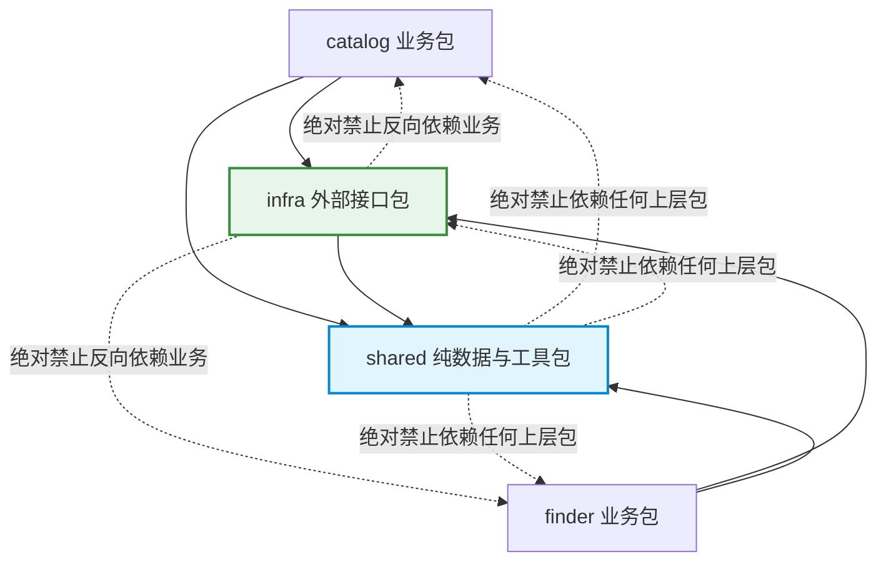

# 重构实施步骤 2：提取共享数据与外部接口（P2 · Infra & Shared）

> **文档标识**：`docs/refactor/03-P2-提取共享数据与外部接口.md`  
> **所属批次**：P2 基础设施与共享层剥离  
> **前置依赖**：[P1 · 定向查找边界与行为修复](./02-P1-定向查找边界与行为修复.md)  
> **后续步骤**：[P3 · 目录任务拆解与统一条目状态机](./04-P3-目录任务拆解与统一条目状态机.md)

---

## 1. 步骤定位与目标

本步骤是整个代码库分层解耦的**基础工程**。核心任务是将散落在各业务模块中的**外部通信（HTTP、GitHub、LLM）**、**系统底层能力（原子文件读写、文件锁、时钟）**以及**纯粹的中性数据模型**剥离出来，建立两个纯粹的基础包：
* **`src/shared/`**：无任何外部业务属性与规则的纯数据结构、中性身份与通用工具。
* **`src/infra/`**：统一封装所有外部系统调用，保留现有签名与目录重试语义，屏蔽第三方 API 与操作系统差异。

### 1.1 依赖架构红线（绝对约束）


1. **`shared` 零业务依赖**：仅包含中性身份、材料快照、Token 账本与时钟；不包含 `domain_hints` 等目录特有概念，不得导入 `catalog`、`finder` 或 `infra`，不加载业务配置，不读取模型凭据。
2. **`infra` 零业务依赖**：只依赖标准库、第三方库（`requests`, `PyYAML`）和 `shared`；保留现有传输参数签名与目录重试语义，查找侧通过配置副本强制 `max_attempts=1`。
3. **消除私有函数借用**：全面废除 `from .budget import _write_json_atomic` 等跨层私有方法借用。

---

## 2. 目标结构与文件映射关系

```text
src/
├── shared/                       # 纯中性通用层
│   ├── __init__.py
│   ├── models.py                 # CandidateIdentity（中性候选身份）
│   ├── materials.py              # DocumentSnapshot、MaterialBundle、validate_document（材料契约）
│   ├── identity.py               # GitHub URL 规范解析、稳定 ID、SHA-256 内容指纹、中性去重
│   ├── schema.py                 # 字符串列表截断、技能形态枚举规范化
│   ├── usage.py                  # Token 事实账本（UsageTotals，已知/未知用量分别统计）
│   └── runtime.py                # Asia/Shanghai 时区、ISO 周标识、格式化时钟
└── infra/                        # 外部基础设施层
    ├── __init__.py
    ├── http.py                   # 有界 HTTP 文本抓取、超时控制与截断标记（fetch_text）
    ├── github.py                 # GitHub API 认证、仓库搜索、仓库树展开（带统一有界重试）
    ├── llm.py                    # 通用模型传输（保留既有调用签名与目录重试语义）、凭据解析
    └── files.py                  # 原子 JSON/文本读写、唯一临时文件、文件锁原语
```

### 源代码迁移与边界划分表

| 原文件路径 | 迁移目标位置 | 提取内容与职责划分 |
| :--- | :--- | :--- |
| `src/models.py` | `src/shared/models.py` | 提取中性实体 `CandidateIdentity`（owner/repo/path/url/name/description）；目录专用的 `domain_hints` 及 `PrescreenResult` 留在 `catalog` |
| （新增） | `src/shared/materials.py` | 纯材料契约：`DocumentSnapshot`、`MaterialBundle`（含集合指纹 `bundle_fingerprint`）、`validate_document` 纯函数 |
| `src/dedupe.py` | `src/shared/identity.py` | 提取 `parse_github_url`、`make_skill_id`、`content_fingerprint`、中性去重；领域线索合并逻辑留 `catalog` |
| `src/schema_utils.py`| `src/shared/schema.py` | 提取 `normalize_string_list`、`normalize_skill_type` |
| `src/usage.py` | `src/shared/usage.py` | 提取 `UsageTotals`（精确记录已知 Token、未知用量请求数、不完整统计数） |
| `src/budget.py` (部分)| `src/shared/runtime.py`| 提取 `SHANGHAI_TZ`、`now_local()`、`week_id()` |
| `src/fetch.py` | `src/infra/http.py` | 提取 `fetch_text()`，重构有界读取契约，精确保留截断标记与状态识别 |
| `src/discover.py` (部分)| `src/infra/github.py` | 提取 `apply_github_auth`、`search_repositories`、`list_skill_paths`，统一退避重试 |
| `src/evaluate.py` (部分)| `src/infra/llm.py` | 提取 `call_model`、`resolve_api_key`、`api_key_source`、`ModelCallResult`（完全保留原签名与目录重试逻辑） |
| `src/budget.py` (部分)| `src/infra/files.py` | 提取 `_write_json_atomic` 重构为公共 `write_json_atomic`，新增文件锁原语与唯一临时文件 |

---

## 3. 核心接口与数据结构实现规范

### 3.1 `shared/materials.py`：纯材料契约与集合指纹

杜绝在内存和磁盘中使用松散字典传递评估材料，确立强类型快照与集合指纹：

```python
from dataclasses import dataclass, field
import hashlib
import re
from typing import Optional

@dataclass(frozen=True)
class DocumentSnapshot:
    """单个文件的不可变材料快照（评估与证据核验必须使用同一份快照）"""
    path: str                           # 规范化仓库相对路径（如 "skills/foo/SKILL.md"）
    text: str                           # 实际抓取到的文本内容（已按字节上限截断）
    fingerprint: str                    # 该文本的 SHA-256 指纹（"sha256:..."）
    fetched_at: str                     # ISO 格式抓取时间
    source_url: str                     # 原始下载链接
    resolved_ref: Optional[str] = None  # 确认的 Git Commit SHA（若无法解析则为 None）
    truncated: bool = False             # 是否超过单文件大小上限被截断

@dataclass(frozen=True)
class MaterialBundle:
    """一个候选技能送审的完整材料包（包含集合指纹与审计摘要）"""
    skill_id: str
    primary_doc: DocumentSnapshot
    referenced_docs: tuple[DocumentSnapshot, ...] = ()
    fetch_errors: dict[str, str] = field(default_factory=dict)

    @property
    def bundle_fingerprint(self) -> str:
        """基于实际送审的同一批材料文本计算集合指纹，时间不参与摘要"""
        all_docs = sorted([self.primary_doc] + list(self.referenced_docs), key=lambda d: d.path)
        combined = "|".join(f"{d.path}:{d.fingerprint}" for d in all_docs)
        return "sha256:" + hashlib.sha256(combined.encode("utf-8")).hexdigest()[:32]

    @property
    def all_materials(self) -> dict[str, str]:
        """供评估与证据核验调用的纯路径-文本映射表"""
        res = {self.primary_doc.path: self.primary_doc.text}
        for doc in self.referenced_docs:
            res[doc.path] = doc.text
        return res

def validate_document(path: str, text: str, max_bytes: int) -> tuple[bool, str]:
    """对已读取材料校验路径、非空/非 HTML/完整性与截断（纯函数，不发网络请求）"""
    clean_path = path.strip("/")
    if not clean_path.endswith("SKILL.md") and not any(clean_path.endswith(ext) for ext in [".md", ".txt"]):
        return False, "非受支持的说明文档类型"
    if not text or not text.strip():
        return False, "文档内容为空"
    # 拒绝 HTML 登录/跳转页面
    if re.search(r"(?i)<!DOCTYPE\s+html|<html[\s>]", text[:500]):
        return False, "内容为 HTML 网页而非有效 Markdown"
    return True, "验证通过"
```

### 3.3 `infra/llm.py`：保留既有调用签名与目录重试语义

为了绝对不破坏目录系统现有的重试行为与测试注入能力，**完整保留 `call_model` 的既有调用签名与重试机制**：

```python
import time
import requests
from typing import Optional, Any
from dataclasses import dataclass, field

DEFAULT_TIMEOUT_SECONDS = 180.0
DEFAULT_MAX_ATTEMPTS = 2
RETRYABLE_STATUS = frozenset({408, 429, 500, 502, 503, 504})
REASON_MODEL_ERROR = "MODEL_ERROR"

@dataclass
class ModelCallResult:
    ok: bool = False
    content: Optional[str] = None
    finish_reason: Optional[str] = None
    model: Optional[str] = None
    usage: dict = field(default_factory=dict)
    latency_ms: int = 0
    attempts: int = 0
    reason_code: Optional[str] = None
    error: Optional[str] = None
    notes: list[str] = field(default_factory=list)
    error_type: Optional[str] = None
    http_status: Optional[int] = None

def call_model(
    model_cfg: dict,
    system: str,
    user: str,
    *,
    api_key: Optional[str] = None,
    session: Optional[requests.Session] = None,
    sleep=time.sleep,
) -> ModelCallResult:
    """通用 OpenAI 兼容传输通道：
    1. 保持现有调用签名不变（入参 model_cfg, system, user 及关键字参数）
    2. 保留从 model_cfg["request"] 中读取 timeout_seconds 与 max_attempts 的既有逻辑
    3. 保留目录现有的遇 408/429/5xx 自动重试语义（默认最多 2 次）
    4. 允许通过 session 和 sleep 注入假网络与时钟进行单元测试
    """
    ...
```

#### 查找侧单次请求强制原则
总方案明确要求：定向查找需要精准核算每次调用的用量与连续失败，不能发生隐藏的底层嵌套重试。
* **目录侧**：直接传递目录 `model_cfg`，正常享受底层重试语义；
* **查找侧**：在 `finder` 入口统一复制 `model_cfg` 副本，并显式设置 `model_cfg["request"]["max_attempts"] = 1`。既不改变 `infra/llm.py` 内部逻辑，也不污染调用方原配置对象。

### 3.4 `infra/files.py`：健壮的原子写与文件锁

```python
import os
import json
from pathlib import Path
from uuid import uuid4
from typing import Any

def write_json_atomic(path: Path | str, payload: Any, indent: int = 2) -> None:
    """原子写入 JSON 文件：
    1. 生成同目录下的唯一临时文件名（uuid4 避免多进程/多任务冲突）
    2. 序列化写入临时文件并刷盘
    3. 调用 os.replace 完成原子重命名替换
    """
    target = Path(path)
    target.parent.mkdir(parents=True, exist_ok=True)
    tmp_path = target.parent / f"{target.name}.{uuid4().hex[:8]}.tmp"
    try:
        content = json.dumps(payload, ensure_ascii=False, indent=indent)
        tmp_path.write_text(content, encoding="utf-8")
        os.replace(tmp_path, target)
    finally:
        if tmp_path.exists():
            try:
                tmp_path.unlink()
            except OSError:
                pass

def read_json(path: Path | str, default: Any = None) -> Any:
    """安全读取 JSON 文件，文件不存在时返回指定默认值"""
    p = Path(path)
    if not p.exists():
        return default
    return json.loads(p.read_text(encoding="utf-8"))
```

---

## 4. 迁移执行步骤与调用点重构

### 操作 1：创建包与基础模块
1. 新建目录 `src/shared/` 与 `src/infra/`，创建各自的 `__init__.py`。
2. 将中性身份、指纹、时钟移入 `src/shared/`，创建 `src/shared/materials.py` 承载纯材料契约。
3. 将底层 HTTP、GitHub、LLM 与文件工具移入 `src/infra/`。

### 操作 2：更新调用方导入
在过渡期间，原旧文件可保留重导出别名，或按批次将调用点更新为新路径：
```python
# 改造后
from src.shared.models import CandidateIdentity
from src.shared.materials import DocumentSnapshot, MaterialBundle, validate_document
from src.shared.runtime import now_local, week_id
from src.infra.files import write_json_atomic, read_json
from src.infra.http import fetch_text
from src.infra.llm import call_model, resolve_api_key
```

### 操作 3：新增基础设施与材料契约测试
新增 `tests/test_files.py` 与 `tests/test_materials.py`，验证：
* 并发原子写与临时文件清理；
* `MaterialBundle` 集合指纹计算的确定性（不受时间影响）；
* `validate_document` 严格拒绝 HTML、空内容与非说明文件。

---

## 5. P2 验收检查清单与准出条件

- [ ] `src/shared/` 与 `src/infra/` 创建完毕，代码结构符合规范。
- [ ] `CandidateIdentity` 仅包含中性身份，`domain_hints` 等目录特有概念留在 `catalog`。
- [ ] `shared/materials.py` 实现就绪，包含 `DocumentSnapshot`、`MaterialBundle`（带集合指纹）及 `validate_document`。
- [ ] `infra/llm.py` 完全保留原 `call_model` 签名与目录重试语义，未破坏测试注入参数。
- [ ] `infra` 和 `shared` 未导入任何业务包（`catalog` 或 `finder`）。
- [ ] 废除全库所有对 `_write_json_atomic` 下划线私有方法的跨模块借用。
- [ ] 新增 `tests/test_files.py` 并通过全部用例。
- [ ] 现有全部测试（包含 P1 新增测试）100% 通过。
- [ ] 提交 Commit：`refactor(infra): 抽取 shared 纯数据层与 infra 基础设施层 (P2)`。
- [ ] **完成上述项后，进入 P3 阶段**。
