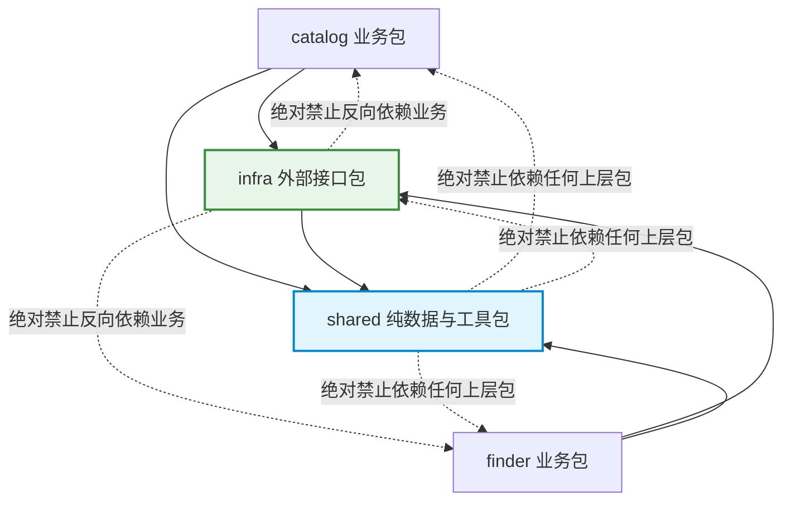

# 重构实施步骤 2：提取共享数据与外部接口（P2 · Infra & Shared）

> **文档标识**：`docs/refactor/03-P2-提取共享数据与外部接口.md`  
> **所属批次**：P2 基础设施与共享层剥离  
> **前置依赖**：[P1 · 定向查找边界与行为修复](./02-P1-定向查找边界与行为修复.md)  
> **后续步骤**：[P3 · 目录任务拆解与统一条目状态机](./04-P3-目录任务拆解与统一条目状态机.md)

---

## 1. 步骤定位与目标

本步骤是整个代码库分层解耦的**基石**。核心任务是将散落在各业务模块中的**外部通信（HTTP、GitHub、LLM）**、**系统底层能力（原子文件读写、文件锁、时钟）**以及**纯粹的中性数据模型**剥离出来，建立两个纯粹的基础包：
* **`src/shared/`**：无任何外部业务依赖的纯数据结构与通用算法。
* **`src/infra/`**：统一封装所有外部系统调用，屏蔽第三方 API 与操作系统差异。

### 1.1 依赖架构红线（绝对约束）


1. **`shared` 零业务依赖**：不得导入 `catalog`、`finder` 或 `infra`，不加载业务配置，不读取模型凭据。
2. **`infra` 零业务依赖**：只依赖标准库、第三方库（`requests`, `PyYAML`）和 `shared`；绝对禁止导入目录规则、查找 Prompt 或业务编排。
3. **消除私有函数借用**：全面废除 `from .budget import _write_json_atomic` 等跨层私有方法借用。

---

## 2. 目标结构与文件映射关系

```text
src/
├── shared/                       # 纯中性通用层
│   ├── __init__.py
│   ├── models.py                 # Candidate、DocumentSnapshot、MaterialBundle
│   ├── identity.py               # GitHub URL 规范解析、稳定 ID、SHA-256 指纹、来源合并
│   ├── schema.py                 # 字符串列表截断、技能形态枚举规范化
│   ├── usage.py                  # Token 事实账本（UsageTotals）
│   └── runtime.py                # Asia/Shanghai 时区、ISO 周标识、格式化时钟
└── infra/                        # 外部基础设施层
    ├── __init__.py
    ├── http.py                   # 有界 HTTP 文本抓取、超时控制与截断标记
    ├── github.py                 # GitHub API 认证、仓库搜索、仓库树展开（带统一有界重试）
    ├── llm.py                    # 通用模型传输、凭据解析、ModelCallResult
    └── files.py                  # 原子 JSON/文本读写、唯一临时文件、文件锁原语
```

### 源代码迁移映射表

| 原文件路径 | 迁移目标位置 | 提取内容与职责 |
| :--- | :--- | :--- |
| `src/models.py` | `src/shared/models.py` | 提取中性实体 `Candidate`，新增 `DocumentSnapshot` 与 `MaterialBundle` |
| `src/dedupe.py` | `src/shared/identity.py` | 提取 `parse_github_url`、`make_skill_id`、`content_fingerprint`、`dedupe` |
| `src/schema_utils.py`| `src/shared/schema.py` | 提取 `normalize_string_list`、`normalize_skill_type` |
| `src/usage.py` | `src/shared/usage.py` | 提取 `UsageTotals`（精确记录已知/未知用量） |
| `src/budget.py` (部分)| `src/shared/runtime.py`| 提取 `SHANGHAI_TZ`、`now_local()`、`week_id()` |
| `src/fetch.py` | `src/infra/http.py` | 提取 `fetch_text()`，重构有界读取契约 |
| `src/discover.py` (部分)| `src/infra/github.py` | 提取 `apply_github_auth`、`search_repositories`、`list_skill_paths` |
| `src/evaluate.py` (部分)| `src/infra/llm.py` | 提取 `call_model`、`resolve_api_key`、`ModelCallResult` |
| `src/budget.py` (部分)| `src/infra/files.py` | 提取 `_write_json_atomic` 重构为公共 `write_json_atomic`，新增文件锁原语 |

---

## 3. 核心接口与数据结构实现规范

### 3.1 `shared/models.py`：材料快照契约
杜绝在内存和磁盘中使用松散字典传递评估材料，确立强类型快照：

```python
from dataclasses import dataclass, field
from typing import Optional

@dataclass(frozen=True)
class DocumentSnapshot:
    """单个文件的不可变材料快照（评估与证据核验必须使用同一份快照）"""
    path: str                 # 规范化仓库相对路径（如 "skills/foo/SKILL.md"）
    text: str                 # 实际抓取到的文本内容（已按字节上限截断）
    fingerprint: str          # 该文本的 SHA-256 指纹（"sha256:..."）
    fetched_at: str           # ISO 格式抓取时间
    source_url: str           # 原始下载链接
    resolved_ref: Optional[str] = None  # 确认的 Git Commit SHA（若无法解析则为 None）
    truncated: bool = False   # 是否超过单文件大小上限被截断

@dataclass
class MaterialBundle:
    """一个候选技能送审的完整材料包"""
    skill_id: str
    primary_doc: DocumentSnapshot
    referenced_docs: list[DocumentSnapshot] = field(default_factory=list)
    fetch_errors: dict[str, str] = field(default_factory=dict)

    @property
    def all_materials(self) -> dict[str, str]:
        """供评估与证据核验调用的纯路径-文本映射表"""
        res = {self.primary_doc.path: self.primary_doc.text}
        for doc in self.referenced_docs:
            res[doc.path] = doc.text
        return res
```

### 3.2 `infra/files.py`：健壮的原子写与文件锁
彻底根除写入半个文件或并发脏读的隐患：

```python
import os
import json
from pathlib import Path
from uuid import uuid4
from typing import Any

def write_json_atomic(path: Path | str, payload: Any, indent: int = 2) -> None:
    """原子写入 JSON 文件：
    1. 生成同目录下的唯一临时文件名（避免多进程冲突）
    2. 序列化写入临时文件并刷盘
    3. 调用 os.replace 完成原子重命名替换
    """
    target = Path(path)
    target.parent.mkdir(parents=True, exist_ok=True)
    # 使用 uuid 确保多任务临时文件唯一
    tmp_path = target.parent / f"{target.name}.{uuid4().hex[:8]}.tmp"
    try:
        content = json.dumps(payload, ensure_ascii=False, indent=indent)
        tmp_path.write_text(content, encoding="utf-8")
        os.replace(tmp_path, target)
    finally:
        if tmp_path.exists():
            try:
                tmp_path.unlink()
            except OSError:
                pass

def read_json(path: Path | str, default: Any = None) -> Any:
    """安全读取 JSON 文件，文件不存在时返回指定默认值"""
    p = Path(path)
    if not p.exists():
        return default
    return json.loads(p.read_text(encoding="utf-8"))
```

### 3.3 `infra/github.py`：统一的 GitHub 基础设施通信
合并 `discover.py` 与 `skill_finder.py` 中重复的 GitHub 通信逻辑，统一退避重试：

```python
def search_repositories(
    query: str,
    *,
    token: str | None = None,
    max_results: int = 20,
    max_retries: int = 3,
    timeout: float = 30.0
) -> list[dict]:
    """统一的 GitHub 仓库检索接口：
    - 查询字符串完全由调用方传入，本函数绝对不私自追加目录领域的排除词
    - 遇到 408/429/5xx 错误执行指数退避重试（1s, 2s, 4s）
    - 明确抛出网络异常或限流异常，供业务层识别
    """
    ...
```

### 3.4 `infra/llm.py`：纯粹模型传输抽象
从 `evaluate.py` 中剥离所有目录六项检查的具体 Prompt，仅保留通道：

```python
def call_model(
    endpoint: str,
    model: str,
    api_key: str,
    system_prompt: str,
    user_prompt: str,
    *,
    timeout: float = 180.0,
    max_output_tokens: int = 4000,
    max_attempts: int = 1
) -> ModelCallResult:
    """纯粹的 OpenAI 兼容接口通信通道：
    - 不包含任何业务 Prompt 逻辑
    - 准确捕获 finish_reason、usage、耗时
    - 严禁隐式吞掉报错
    """
    ...
```

---

## 4. 迁移执行步骤与调用点重构

### 操作 1：创建包与基础模块
1. 新建目录 `src/shared/` 与 `src/infra/`，并在各自目录下创建 `__init__.py`。
2. 迁移中性函数至 `shared/`，编写单元测试。
3. 迁移底层 I/O 至 `infra/`，编写文件原子写与锁测试。

### 操作 2：平滑更新现有代码导入（阶段过渡）
在旧模块（`models.py`、`dedupe.py`、`fetch.py`）中保留过渡重导出别名，或一次性全局替换调用点：
```python
# 改造前
from .models import Candidate
from .budget import _write_json_atomic, now_local
from .fetch import fetch_text

# 改造后
from src.shared.models import Candidate
from src.shared.runtime import now_local
from src.infra.files import write_json_atomic
from src.infra.http import fetch_text
```

### 操作 3：新增基础设施专属测试
新增 `tests/test_files.py`，专门测试高并发原子写、进程异常中断清理与损坏 JSON 处理：
```powershell
.\.venv\Scripts\python.exe -m unittest tests.test_files -v
```

---

## 5. P2 验收检查清单与准出条件

- [ ] `src/shared/` 与 `src/infra/` 创建完毕，代码结构符合规范。
- [ ] `infra` 和 `shared` 未导入任何业务包（`catalog` 或 `finder`）。
- [ ] 废除全库所有对 `_write_json_atomic` 下划线私有方法的跨模块引用。
- [ ] `DocumentSnapshot` 与 `MaterialBundle` 数据结构就绪，通过类型检查。
- [ ] 新增 `tests/test_files.py` 并通过全部用例。
- [ ] 现有全部 235 项测试及 P1 增加的测试全部通过。
- [ ] 提交 Commit：`refactor(infra): 抽取 shared 基础模型与 infra 基础设施层 (P2)`。
- [ ] **完成上述项后，进入 P3 阶段**。
