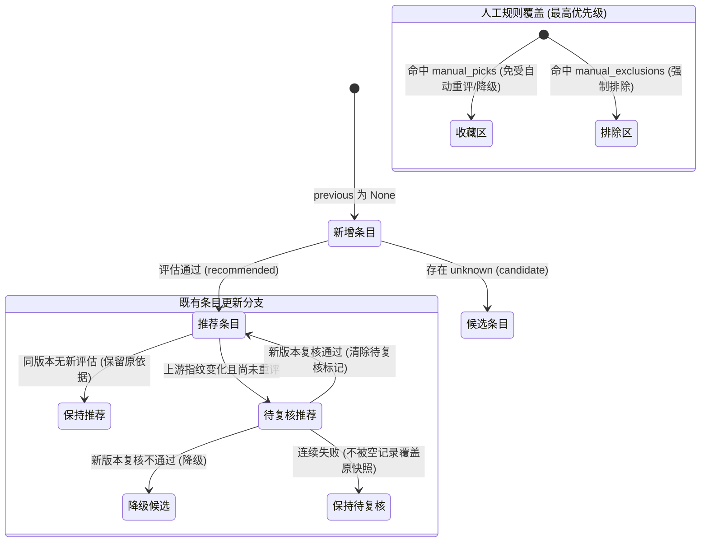
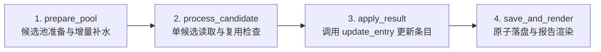

# 重构实施步骤 3：目录任务拆解与统一条目状态机（P3 · Catalog Core）

> **文档标识**：`docs/refactor/04-P3-目录任务拆解与统一条目状态机.md`  
> **所属批次**：P3 目录系统解耦与状态机统一  
> **前置依赖**：[P2 · 提取共享数据与外部接口](./03-P2-提取共享数据与外部接口.md)  
> **后续步骤**：[P4 · 定向查找独立分包与报告安全投影](./05-P4-定向查找独立分包与报告安全投影.md)

---

## 1. 步骤定位与目标

本步骤是整个架构重构中**业务复杂度最高、收益最显著的核心环节**。主要攻坚两大结构性难题：
1. **彻底拆解超千行的大文件**：拆分 1,270 行的 `src/pipeline.py` 与 619 行的 `src/local_run.py`（包含近 400 行的 `_collect()` 巨型闭包函数）。
2. **消灭条目双重更新逻辑**：目前本地与 Actions 各自维护了一套条目更新分支（`local_run:publish()` 与 `pipeline:entry_for()`），极易在后续维护中产生逻辑分叉。本步骤将其收敛为唯一且具备严格状态矩阵的纯函数——`update_entry()`。

---

## 2. 目标结构与模块职责划分

重构后的目录系统全部收敛至 `src/catalog/` 业务包，原根目录的 `pipeline.py` 蜕化为轻量 CLI 入口：

```text
src/
├── pipeline.py                 # 薄 CLI 壳（保留原命令行参数分派，不含具体业务逻辑）
└── catalog/                    # 主目录系统业务包
    ├── __init__.py
    ├── entry_state.py          # 【核心】纯函数 update_entry 与条目状态转移矩阵
    ├── store.py                # 目录读写事务锁与原子落盘（catalog.json 与 public 页面同步）
    ├── config.py               # 目录全部配置加载、交叉引用与 precheck 预检
    ├── queue.py                # Actions 跨轮队列管理、公平轮转、结清判定与序列化
    ├── sync_reserve.py         # 阶段一（reserve）：发现、预筛、预留额度、dry-run 编排
    ├── sync_evaluate.py        # 阶段二（evaluate）：评估预留项、调用决策机、合并输出
    ├── local.py                # 本地 50 个推荐目标与 100M Token 预算主循环编排
    ├── maintenance.py          # 离线维护任务（0 Token 配置同步与结构化增强）
    ├── discovery.py            # 目录专属查询词、官方/社区种子展开策略
    ├── evaluation.py           # 目录六维评估 Prompt、解析与评估 ID 生成
    ├── prescreen.py            # 目录免模型预筛与 PrescreenResult
    ├── decide.py               # 准入决策机纯函数（recommended/candidate/excluded）
    ├── overrides.py            # 人工收藏（manual_picks）与黑名单干预
    ├── snooze.py               # 150 天临时冷冻加载、校验与解冻
    ├── enrich.py               # 单条离线保守提取（形态、示例、亮点）
    ├── index.py                # 条目、主目录与页面投影转换
    ├── budget.py               # ISO 周配额账本与评估记录
    ├── pool.py                 # 本地候选池缓存、断点续跑与补水
    └── report.py               # 周差异报表与本地运行报告渲染
```

---

## 3. 核心设计：统一条目状态机（`entry_state.py`）

### 3.1 纯函数签名设计
```python
from dataclasses import dataclass
from typing import Optional, Any
from src.shared.models import Candidate

@dataclass(frozen=True)
class EntryUpdateEvent:
    """条目更新事件（替代松散字典与非空判断）"""
    kind: str  # "fresh_evaluation" | "cached_evaluation" | "no_evaluation" | "fetch_failed"
    prescreen_result: Any
    evaluation: Optional[dict] = None
    decision: Optional[dict] = None
    upstream_status: str = "ok"
    fetched_fingerprint: Optional[str] = None
    rules_version: str = "1.0.1"

def update_entry(
    previous_entry: Optional[dict],
    candidate: Candidate,
    event: EntryUpdateEvent,
    context: Any
) -> dict:
    """目录条目更新的唯一事实标准（纯函数）：
    - 绝不进行任何文件读写、网络调用或模型通信
    - 严格根据 previous_entry 与 event 计算出最新的条目全量字典
    - 统一处理版本继承、快照保护、待复核标记与人工干预投影
    """
    ...
```

### 3.2 严格的状态转移矩阵（State Transition Matrix）

无论是本地运行还是 Actions 执行，针对同一事件必须产生完全相同的条目结果：



| 场景事件 | 既有条目状态 | 规则约束与必须成立的断言 |
| :--- | :--- | :--- |
| **同版本无新评估** | 任意有效状态 | 必须**完整保留**原有的 `summary_zh`、分类及评估证据，绝不能因 outcome 非空而清空字段。 |
| **同版本新评估显式返回空** | 含有离线增强字段 | 接受新评估结论（若其明确为 `null`/`[]`），**绝不复活**已被丢弃的旧增强字段。 |
| **旧格式缓存缺字段** | 版本与缓存一致 | 仅在版本完全一致时允许向前继承缺失字段；严格区分“字段缺失”与“明确空值”。 |
| **新版本尚未评估成功** | 推荐条目 (`recommended`) | **保留推荐状态**，醒目标记 `needs_review=True`，并将原有效评估存入 `pending_review` 快照。 |
| **新版本连续多次调用失败** | 待复核条目 | **不得被中间的空错误记录覆盖**，继续牢牢锁住最近一次有效的历史评估快照。 |
| **新版本复核评估成功** | 待复核条目 | 根据新评估结论判定：若通过则更新依据并清除 `needs_review`；若未过则降级至 `candidate`。 |
| **人工干预规则应用** | 任意条目 | 收藏项标记 `manual_pick=True`，变化只提示不自动降级；黑名单项一票否决为 `excluded`。 |

---

## 4. 两大巨型文件的拆解重构路线

### 4.1 拆解 `pipeline.py`（1,270 行 $\to$ 薄 CLI）
将原本杂糅在 `pipeline.py` 中的五类代码彻底剥离：
1. **配置加载与预检**：移至 `catalog/config.py`，输出 `CatalogConfig`。
2. **跨轮待办队列**：移至 `catalog/queue.py`，集中管理 `queue.json` 的排序、积压合并与结清判定。
3. **两阶段执行流水线**：
   * `prepare()` 与 `phase_reserve()` 抽取为 `catalog/sync_reserve.py`（负责发现、预筛并在调用前将配额预留写入磁盘）。
   * `phase_evaluate()` 抽取为 `catalog/sync_evaluate.py`（负责加载预留、发起调用、调用 `update_entry` 合并并生成发布产物）。
4. **原文件保留**：`src/pipeline.py` 仅保留 `argparse` 参数解析与对 `sync_reserve` / `sync_evaluate` 的调用转发，文件体积缩减至 100 行以内。

### 4.2 拆解 `local_run.py` 中的 `_collect()`（近 400 行大函数）
原有 `_collect()` 内部通过闭包同时读写 `entries`、`ledger`、`pool`、`usage`、`report`、`dirty` 等十余个外部变量，维护风险极大。将其重构为四个清晰的包内步骤：



1. **Step 1：候选池准备**：调用 `pool.py` 检查待处理数量，低于水位线增量补水并返回首批待处理队列。
2. **Step 2：单候选处理**：负责材料读取、缓存命中判定、LLM 有界调用，返回 `CandidateProcessResult`。
3. **Step 3：状态应用**：接收处理结果，调用 `entry_state.update_entry()`，纯内存更新条目清单。
4. **Step 4：持久化与渲染**：调用 `catalog/store.py` 原子写入 `data/catalog.json`，调用 `catalog/report.py` 渲染本地运行 Markdown/JSON 报表。

---

## 5. 目录事务持久化协调（`store.py`）

防止在多任务或离线维护并发时出现陈旧内存覆盖新数据的问题，实现单根目录排他写锁：

```python
class CatalogStore:
    """管理 catalog.json 与 public/data/catalog.json 的读改写全流程"""
    def __init__(self, root_dir: Path):
        self.root_dir = root_dir
        self.lock_file = root_dir / "data" / ".catalog.lock"
    
    def mutate(self, mutator_fn) -> dict:
        """带锁的读-改-写事务：
        1. 获取文件排他锁
        2. 读取最新的 data/catalog.json
        3. 执行业务修改回调 mutator_fn(catalog_data)
        4. 双写原子替换 data/catalog.json 与 public/data/catalog.json
        5. 释放文件锁并返回更新清单
        """
        ...
```

---

## 6. 验证测试与新增用例（对应验收矩阵 T09～T10）

本步骤必须新增 `tests/test_entry_state.py`，专门对状态转移矩阵进行穷尽验证：

```powershell
.\.venv\Scripts\python.exe -m unittest tests.test_entry_state -v
```

| 编号 | 测试用例名称 | 验证核心逻辑 |
| :--- | :--- | :--- |
| **T09-1** | `test_entry_preserves_description_when_no_evaluation` | 同版本无新评估时，条目描述与证据 100% 保持原样 |
| **T09-2** | `test_entry_explicit_null_does_not_resurrect` | 新评估返回 null 时，确认旧增强字段被正确清空 |
| **T09-3** | `test_content_changed_retains_recommended_with_review_flag` | 指纹变更后保留 `recommended` 状态，且必须包含完整原评估快照 |
| **T09-4** | `test_consecutive_failures_do_not_overwrite_valid_snapshot` | 连续多次调用失败，原待复核快照坚决不被空错误抹除 |
| **T09-5** | `test_actions_and_local_yield_identical_entry` | 本地采集与 Actions 收到相同事件时，生成的条目字典完全哈希一致 |
| **T10** | `test_pipeline_two_phases_roundtrip` | 阶段一预留、阶段二消费并完成发布的全链路模拟测试 |

---

## 7. P3 验收检查清单与准出条件

- [ ] `src/catalog/` 包完整建立，所有子模块职责清晰。
- [ ] `update_entry()` 成为全库唯一的条目更新实现，已删除旧 `publish()` 与 `entry_for()` 的重复分支。
- [ ] `_collect()` 拆解完成，移除了所有跨函数脏闭包。
- [ ] `src/pipeline.py` 瘦身成功，现有 `--phase reserve/evaluate/all` 命令与参数完全兼容。
- [ ] 新增 `tests/test_entry_state.py` 且通过 T09/T10 全部测试。
- [ ] 本地预检 `--check`、离线维护 `--sync-config` 运行正常且绝对不产生网络与模型调用。
- [ ] 提交 Commit：`refactor(catalog): 拆分 catalog 业务包并统一条目状态机 (P3)`。
- [ ] **完成上述项后，进入 P4 阶段**。
