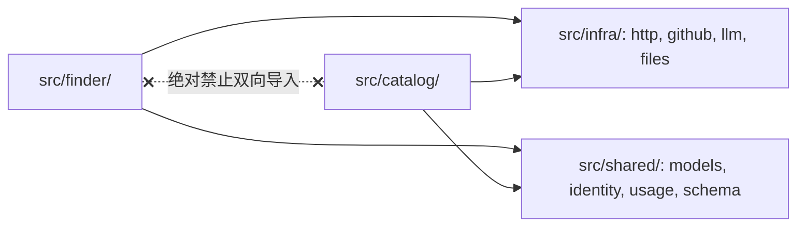
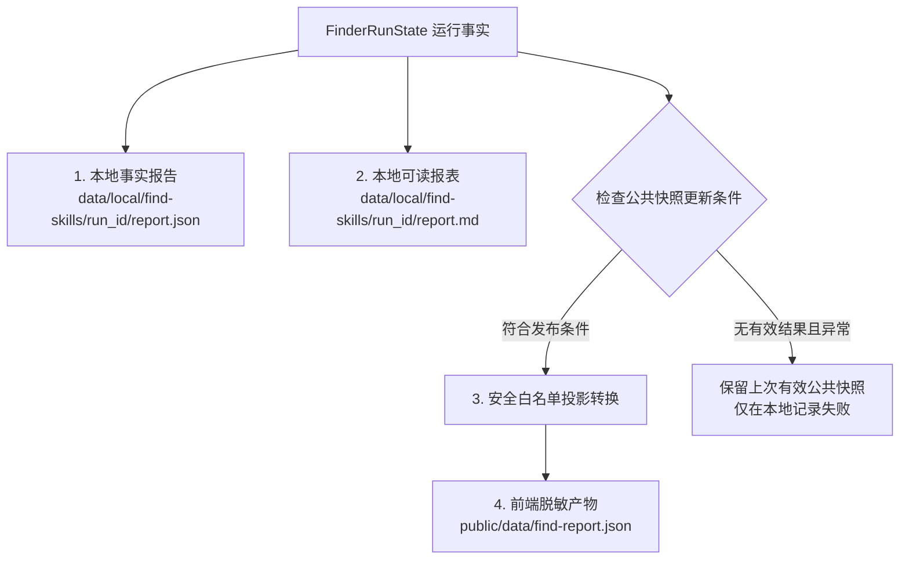

# 重构实施步骤 4：定向查找独立分包与报告安全投影（P4 · Finder Package）

> **文档标识**：`docs/refactor/05-P4-定向查找独立分包与报告安全投影.md`  
> **所属批次**：P4 查找业务独立与展示层安全隔离  
> **前置依赖**：[P3 · 目录任务拆解与统一条目状态机](./04-P3-目录任务拆解与统一条目状态机.md)  
> **后续步骤**：[P5 · 清理收尾与架构守卫回归](./06-P5-清理收尾与架构守卫回归.md)

---

## 1. 步骤定位与目标

本步骤的核心是将此前已在 P1 完成行为修复的定向查找逻辑，正式独立为顶层业务包 **`src/finder/`**，并解决展示层的安全合规与数据发布契约：
1. **彻底与主目录解耦**：落实“定向查找跳过目录规则”的强制约束，`finder` 业务包在物理上**绝对不导入** `catalog` 的任何代码，运行时零目录副作用（不修改主索引、周账本或候选池）。
2. **拆解编排大文件**：将 729 行的 `skill_finder.py` 与 589 行的 `find_evaluate.py` 拆分为内聚的子模块（配置、搜索、规划、评估、证据核验、运行编排、报表）。
3. **建立安全白名单数据投影与条件发布机制**：严禁直接将包含本机绝对路径的 JSON 写入前端目录。明确定义公共快照的更新发布条件与短写锁，避免旧结果误展示或被失败任务清空。

---

## 2. 目标结构与模块职责划分

```text
src/
└── finder/                      # 定向查找专属业务包（与 catalog 平级且物理隔离）
    ├── __init__.py
    ├── config.py                # 查找参数校验、优先级合并与数值规范化
    ├── search.py                # 多查询轮转、仓库树提取、按需抓取原文快照
    ├── plan.py                  # 需求意图解析、查询规划 Prompt 与准则生成
    ├── evaluation.py            # 单技能评估 Prompt、结构校验、综合加权排名
    ├── evidence.py              # 【纯函数】代码级证据客观比对（路径/行号/引文），不修改输入
    ├── run.py                   # 查找主生命周期编排、用量停止、统一收尾 finalize_run
    └── report.py                # 本地事实报表生成与公共前端展示投影（白名单过滤）
tools/
└── find_skill.py                # 薄 CLI 入口（交互式输入、参数转交、退出码映射）
```

### 依赖隔离红线


---

## 3. 详细设计与核心实现

### 3.1 纯证据核验模块（`finder/evidence.py`）
该模块必须设计为**无副作用纯函数**。核验过程中绝不修改传入的材料或原始评估对象，而是返回全新的核验判定结果：

```python
from typing import NamedTuple, Any
from src.shared.materials import DocumentSnapshot

class EvidenceVerificationResult(NamedTuple):
    is_valid: bool
    verified_file: str
    start_line: int
    end_line: int
    matched_quote: str
    failure_reason: str = ""

def verify_single_evidence(
    quote_claim: dict[str, Any],
    documents: dict[str, DocumentSnapshot]
) -> EvidenceVerificationResult:
    """针对单条引文证据执行零幻觉核验（纯函数）：
    - 协议对齐：source_path / quote / start_line / end_line
    - 严格排除布尔值行号，排除空引文
    - 路径必须存在于已读取材料集合，行号不得越界
    - 引文文本经空白标准化后必须完全属于指定行区间
    """
    ...
```

### 3.2 运行生命周期与记账控制（`finder/run.py`）
实现严密的三计数器控制循环，将 F1～F6 的修复逻辑正式固化：

```python
class FinderRunState:
    """追踪单次定向查找运行中的全部事实状态"""
    def __init__(self, topic: str, params: dict):
        self.run_id = f"{now_local().strftime('%Y%m%d-%H%M%S')}-{uuid4().hex[:6]}"
        self.topic = topic
        self.params = params
        self.plan = {}                   # 固化保存规划，供排序与收尾使用
        self.evaluation_attempts = 0     # 已经发起的评估尝试次数
        self.evaluated_items = []        # 成功评估条目
        self.failed_items = []           # 失败记录（记录原因，用于诊断）
        self.usage = UsageTotals()       # 实际 Token 消耗
        self.status = "in_progress"
        self.stop_reason = ""
```

* **统一收尾保障**：捕获所有可能的退出点（包括 `KeyboardInterrupt` 与未捕获异常），在 `finally` 块中确保调用 `finalize_run(state, stop_reason)`，保证任何情况下磁盘上都有可查的局部结果。

---

## 4. 报告安全投影与公共快照发布条件（`finder/report.py`）

### 4.1 双层报告隔离架构


### 4.2 公共快照（`find-report.json`）更新发布条件矩阵

总方案明确规定：**不能盲目无差别写公共页面数据，必须避免旧结果冒充新结果，同时防止失败任务清空已有展示**：

| 运行结束场景 | 是否更新 `public/data/find-report.json` | 写入内容与页面呈现 |
| :--- | :---: | :--- |
| **正常完成，有推荐结果** | **是** | 写入最新完整短名单、备选与评估统计。 |
| **正常完成，但无匹配结果（0 推荐）** | **是** | **写入空结果快照**。防止旧主题残留误导用户以为当前需求找到了结果。 |
| **异常中断/熔断，但已有部分有效条目** | **是** | **写入带明确状态的部分结果**（如 `status: stopped`, `evaluated_count: 3`），展示已完成的卡片及中断原因。 |
| **完全失败/启动错误，无任何有效条目（0 成功）** | **否（保留旧快照）** | **坚决保留上次有效的公共快照**，绝不生成全空损坏文件！仅在本次本地 `report.json` 中记录失败原因。 |

### 4.3 白名单安全投影实现规范
前端页面只允许接收经过白名单过滤的脱敏字段，物理剔除敏感路径：

```python
def build_public_find_projection(run_state: FinderRunState) -> dict:
    """白名单投影转换器：严禁泄露内部绝对路径与凭据"""
    return {
        "schema_version": "1.0.0",
        "run_id": run_state.run_id,
        "topic": run_state.topic,
        "updated_at": run_state.completed_at,
        "status": run_state.status,
        "stop_reason": run_state.stop_reason,
        "parameters": {
            "limit": run_state.params["limit"],
            "max_evaluations": run_state.params["max_evaluations"],
        },
        "statistics": {
            "evaluation_attempts": run_state.evaluation_attempts,
            "evaluated_count": len(run_state.evaluated_items),
            "total_tokens": run_state.usage.total_tokens,
        },
        "query_plan": {
            "intent": run_state.plan.get("intent", ""),
            "criteria": run_state.plan.get("criteria", []),
        },
        "shortlist": [
            _sanitize_card(item) for item in run_state.shortlist
        ],
        "alternatives": [
            _sanitize_card(item) for item in run_state.alternatives
        ]
    }

def _sanitize_card(item: dict) -> dict:
    """卡片脱敏：仅保留上游链接、技能名称、匹配度、核验后的引文片段"""
    return {
        "skill_id": item["skill_id"],
        "name": item.get("name", ""),
        "url": item.get("url", ""),
        "repo_url": item.get("repo_url", ""),
        "match_level": item.get("match_level", "none"),
        "summary": item.get("summary", ""),
        "matched_criteria": item.get("matched_criteria", []),
        "verified_evidence": item.get("verified_evidence", [])
    }
```

* **短写锁与原子写入**：更新 `public/data/find-report.json` 时，通过短排他锁与 `write_json_atomic` 写入，杜绝前端并发拉取到半截残缺 JSON。

---

## 5. 前端展示层适配（`public/index.html`）

配合后端的脱敏结构，升级前端 `renderFindView()`：
1. **状态标签增强**：正确渲染 `usage_unknown`（黄色警告：用量缺失停机）、`token_limit`（已达预算）等提示条。
2. **多指标展示**：除展示推荐数量外，在顶部统计栏增加显示“尝试评估数 / 实际成功数”与“消耗 Token”。
3. **严格 XSS 防护**：对用户的 `topic`、上游引文文本与 LLM 生成的中文简述进行统一转义，避免富文本注入。

---

## 6. 验证测试与场景（对应验收矩阵 T08、T11、T13）

```powershell
.\.venv\Scripts\python.exe -m unittest tests.test_skill_finder tests.test_find_evaluate -v
```

| 编号 | 测试用例名称 | 验证核心逻辑 |
| :--- | :--- | :--- |
| **T08** | `test_finder_completely_ignores_catalog_rules` | 目录主分类排除词（如 AI 开发）、黑名单存在时，finder 依然正常评估并产出结果；且目录主索引与周账本哈希绝对不变 |
| **T11** | `test_public_projection_sanitizes_absolute_paths` | 检查导出的 `public/data/find-report.json`，断言其中绝不包含盘符、绝对路径或系统用户名 |
| **T11-2**| `test_public_snapshot_update_conditions` | 模拟 0 匹配正常完成（覆盖写空）与 0 成功异常失败（保留旧快照）两种边界 |
| **T13** | `test_frontend_find_view_renders_various_stop_states` | 模拟各种中断、异常及用量停止数据，断言前端视图渲染不崩溃 |

---

## 7. P4 验收检查清单与准出条件

- [ ] `src/finder/` 业务包创建完毕，包含 config、search、plan、evaluation、evidence、run、report 七个子模块。
- [ ] `tools/find_skill.py` 改造为纯 CLI 入口，成功分派任务并准确返回对应退出码（0/1/2/130）。
- [ ] 静态检查确认 `src/finder/` 没有任何一处导入 `src.catalog`。
- [ ] 严格落实公共快照更新条件：正常 0 匹配写空覆盖，异常 0 成功保留旧快照。
- [ ] 运行一次查找，验证 `data/catalog.json`、`data/local/pool.json` 与 `data/state/budget.json` 未发生任何修改（0 目录副作用）。
- [ ] 验证 `public/data/find-report.json` 内容脱敏完全，浏览器访问定向查找 Tab 视图正常渲染。
- [ ] 提交 Commit：`refactor(finder): 建立独立 finder 业务包与安全报告投影 (P4)`。
- [ ] **完成上述项后，进入 P5 阶段**。
