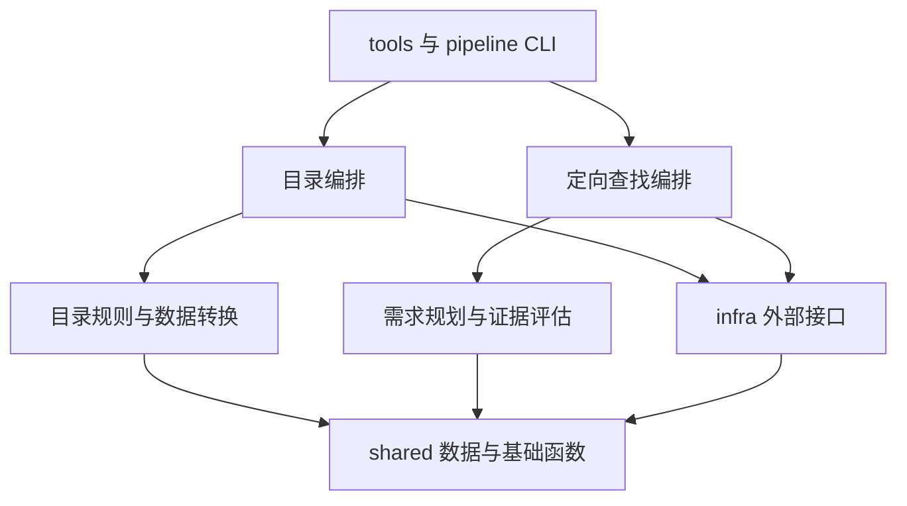

# src 分层与轻量化评估

评估日期：2026-09-22。代码基准：`361cd08fa389356648d58431fb25dda738cd4318`。开始评估时工作区干净。

本轮交付是代码分析、离线复现与可执行的分层方案。没有实施业务修改、调用真实模型、运行真实网络采集或发布页面。用户此前暂缓的问题不在本轮逐条复查；本轮重点是新增定向查找后的结构、长文件，以及影响拆分边界的新问题。

**结论：应开始分层，但保持函数式的小型项目结构。当前技术栈和数据规模仍然轻量；增长最快的是编排职责和重复规则。优先拆解 `pipeline.py`、`local_run.py`、`skill_finder.py`，将目录业务和定向查找分开，并提取真正共享的外部接口。**

## 1. 当前规模与判断依据

| 检查项 | 当前结果 | 维护含义 |
| --- | --- | --- |
| `src` | 21 个 Python 文件，6,865 行，含空行、注释 | 比上次审查基准的 5,528 行增加 1,337 行 |
| `pipeline.py` | 1,269 行 | 配置、队列、业务状态、两阶段任务、落盘、CLI 共处一处 |
| `local_run.py` | 618 行；`_collect()` 397 行 | 最长函数，同时修改多个运行状态 |
| `skill_finder.py` | 728 行；`execute_find_skill()` 262 行 | 新功能已出现同样的编排膨胀 |
| `find_evaluate.py` | 588 行 | 规划、Prompt、解析、证据与排序集中；较长，但比编排文件内聚 |
| 另外两个较大文件 | `discover.py` 504 行；`evaluate.py` 435 行 | 都混合了可共享的外部通信和目录专用逻辑 |
| 页面 | `public/index.html` 1,177 行，内联脚本 1,019 行 | 定向结果渲染继续加入同一全局状态闭包 |
| 直接运行依赖 | `requests`、`PyYAML` | 暂无增加框架或运行服务的必要 |
| 数据体积 | 主索引 164,517 字节；页面目录 125,049 字节 | JSON 存储仍然适合当前规模 |
| 原有测试 | 235 项通过 | 尚无 `test_skill_finder.py` 和 `test_find_evaluate.py` |
| 静态依赖检查 | 当前 `src` 相对导入图未发现环 | 主要问题是职责归属与修改传播范围 |

行数是定位线索。`_collect()` 虽然所在文件小于 `pipeline.py`，却是更集中的修改热点。`find_evaluate.py` 包含较多 Prompt 和说明文字，不能仅因 588 行就按相同行数切块。

当前应保留：简单 Python 函数、数据类、JSON 持久化、静态页面、现有 CLI、模型响应与业务决策分离、可替换的网络和模型调用。没有证据支持引入数据库、Web 后端、任务队列、依赖注入框架或通用工作流引擎。

## 2. 已出现的架构问题

### 2.1 本地采集依赖另一个完整任务的编排模块

[local_run.py:21](../src/local_run.py:21) 从 `pipeline.py` 导入 `load_all_config`、`precheck`、`admission_decision`、`review_state`。

这些分别属于配置和条目更新规则。它们应由两种目录任务共同使用。现在修改配置或复核规则要进入 Actions 编排文件；把 `pipeline.py` 搬进一个新文件夹仍会留下这个问题。

同一条目的更新又分别出现在本地 `publish()` 和 Actions 的 `entry_for()`：前者位于 [local_run.py:198](../src/local_run.py:198)，后者位于 [pipeline.py:1015](../src/pipeline.py:1015)。新字段要同步维护两处分支。

建议抽出目录专用的纯函数 `update_entry()`，集中处理版本、评估结果、人工配置投影和待复核状态。调用者负责账本、循环、网络和写文件。旧行为中的争议与已知问题应分别写成回归用例后修正，避免搬迁时无说明地改变业务。

### 2.2 外部接口藏在目录模块中，新功能难以正确复用

[evaluate.py:190](../src/evaluate.py:190) 的 `call_model()` 是通用模型传输，但同文件包含目录六项检查的 Prompt、分类解析和评估 ID。定向查找只需要传输，却必须导入整个目录评估模块。

[discover.py:114](../src/discover.py:114) 同时包含 GitHub 搜索、认证、仓库树读取，以及目录搜索模板、种子来源和展开策略。新增 [skill_finder.py:138](../src/skill_finder.py:138) 又实现了一次 GitHub 仓库搜索：现有版本包含有界重试，新版本只有一次 `get()`，`sleep` 参数未用于重试。

应把 GitHub 认证、请求、结果解析、树完整性检查放入 `infra/github.py`；把目录查询与种子规则保留在 `catalog/discovery.py`，把需求查询和轮转策略保留在 `finder/search.py`。基础接口接受明确的查询字符串，不能默认附加目录排除词。

**定向查找跳过目录规则是固定要求。分层后 `finder` 不得直接或间接依赖目录分类、预筛、黑名单、冷冻和周配额。**

### 2.3 文件写入借用周预算模块，保存报告又承担页面输出

[pool.py:21](../src/pool.py:21) 和 [skill_finder.py:26](../src/skill_finder.py:26) 导入 `budget._write_json_atomic`、`now_local`。候选池或查找报告的存储没有周配额含义，跨模块借用下划线函数也说明公共接口尚未放在合适的位置。

[skill_finder.py:394](../src/skill_finder.py:394) 的 `save_current_report()` 同时保存本地 JSON、Markdown 和 `public/data/find-report.json`。运行开始就会写入公共页面数据路径，页面写入异常则被吞掉。

前端展示查找结果可以保留，但应明确拆成“本地运行记录”和“页面投影”两步。页面投影只包含展示字段，不直接复制本地绝对路径等运行信息。由编排层选择何时更新，写入失败要有可见诊断。当前代码能证明会写本地 `public/`，不能据此声称已经自动发布到远端。

提取 `infra/files.py` 的原子 JSON/文本写入函数；时间辅助放在中性模块。对于多个进程共享的页面快照，临时文件名应唯一。原子替换负责避免半文件，调用方另行处理并发覆盖顺序。

### 2.4 配置、维护命令与数据转换混在一起

配置加载分散于 `pipeline.load_all_config()`、`prescreen.load_config()`、`discover.load_searches()` 和定向查找的两个配置函数。`local_run.main()` 同时分派采集、离线配置同步与离线增强。

[index.py:337](../src/index.py:337) 的 `sync_config_to_catalog()` 已经是一条完整维护任务；[enrich.py:191](../src/enrich.py:191) 的 `enrich_catalog()` 同样负责读、改、写索引。

建议把目录配置组合放到 `catalog/config.py`，两个维护流程放到 `catalog/maintenance.py`。`index.py` 保留条目、目录和页面数据转换；`enrich.py` 保留单条结构化提取。模型连接文件可共用读取能力，但目录配置和查找配置分别校验、分别组合。

## 3. 新增功能中已复现的行为问题

以下使用生产函数、临时目录与假网络/模型。业务解析、证据校验、排序与入口逻辑均执行真实代码。它们是拆分时需要保护或修复的边界，并非真实服务商调用结果。

### 3.1 P1：未知用量和请求超时后仍继续调用模型

位置：[规划调用后的处理](../src/skill_finder.py:423)、[候选调用后的处理](../src/skill_finder.py:520)、[用量累计](../src/usage.py:20)。

`UsageTotals` 正确记录 `unknown_usage_requests`，但查找编排只检查已知 `total_tokens`，没有根据未知用量停止。

复现：规划响应缺少 usage，随后仍完成 2 次候选评估；某次评估超时、用量未知后，下一个候选仍被调用。最终可能显示 `completed / target_reached`。

建议在查找流程中统一一次模型调用的记账出口：记录调用结果、更新已知/未知用量、持久化，再决定是否允许下一次调用。规划也使用这一出口。实际用量未知时停止后续模型请求，保留已有有效结果。三种任务的额度策略可以不同，但未知用量的事实不能被忽略。

### 3.2 P1：评估上限约束的是成功结果数量

位置：[skill_finder.py:491](../src/skill_finder.py:491)。

上限使用 `len(evaluated_items)`，解析失败和请求失败不增加这个数量。复现将 `max_evaluations=2`，返回一次无效 JSON、两次有效结果，实际发起了 **3 次候选评估请求**，加上规划共 4 次模型调用。

应区分候选评估尝试数、成功评估数、模型请求数。候选开始调用前占用本轮评估名额，失败仍占名额；`limit` 只控制展示。不要把原本清晰的上限参数悄悄改成“成功结果目标”。

### 3.3 P1：部分引文匹配仍可被标为有效证据

位置：[find_evaluate.py:384](../src/find_evaluate.py:384)。

当前允许路径后缀匹配、全文匹配，以及引文前 20 个或后 20 个字符匹配。校验通过后继续保留模型给出的原路径和行号。

复现：真实材料只有 `SKILL.md`，模型引用 `nonexistent/SKILL.md`、第 99,999 行，引文包含真实句子和捏造的“所有测试均为 100%”保证，最后仍是 `supported / strong`。

应使用已读材料的精确规范路径、有效行号和完整引文校验。若容忍模型数错行号，必须找到完整引文并返回程序定位后的路径、起止行；无法可靠定位就降为 `unknown`。代码只能证明引文存在，不能仅凭子串相同证明引文支持某个能力，也不能宣称因此消除了模型幻觉。

### 3.4 P2：失败、中断和无匹配没有统一收尾

位置：[无仓库分支](../src/skill_finder.py:458)、[正常排序](../src/skill_finder.py:555)、[中断处理](../src/skill_finder.py:576)。

复现两种情况：

- 全部 GitHub 查询返回 HTTP 429，结果被标为 `completed / candidates_exhausted`，用户难以区分检索失败与没有候选。
- 已有 1 条有效评估后中断，JSON 中 `evaluations` 保留该条，但短名单仍为空，Markdown/前端不能正常展示它；状态为 `completed`，CLI 还会返回成功退出码。

建议一个 `finalize_run()` 在正常、预算停止、错误和中断路径统一执行：基于已有评估重新排名、设置明确状态、保存报告。分别记录结束状态和匹配数量。每次失败和跳过要进入运行记录，不能只 `print()` 后消失。

### 3.5 P2：材料入口尚未形成完整契约

位置：[仓库文件名判断](../src/discover.py:459)、[原文抓取](../src/skill_finder.py:271)。

复现：`NOT_SKILL.md` 被 `.endswith("SKILL.md")` 当作技能；HTTP 成功且内容为登录 HTML 的材料仍返回 `ok=True`。这只能证明材料会被接受进入后续流程，不能推断它一定被模型推荐。

应精确判断路径 basename；原文抓取返回同一份文本、路径、指纹、读取时间和可确认的版本。明确拒绝空文本、HTML 和截断材料。引用文档也应各自记录指纹与来源。HTTP 层负责读取，调用边界负责“这是可评估的 Skill 材料”的约束。

### 3.6 P2：候选覆盖与需求标准会被隐式改变

位置：[查询循环](../src/skill_finder.py:439)、[文件轮转](../src/skill_finder.py:231)、[规划解析](../src/find_evaluate.py:179)。

复现：规划有两个查询，第一个返回 20 个仓库后，第二个完全不执行。随后各仓库路径按字典顺序取前 10 个，未结合需求安排顺序，合集内名称靠后的相关技能容易失去读取机会。

另一个复现：规划仅给出 `quality_signal` 时，解析器自动把第一项提升为 `required`。质量观察项可能被变成用户没有提出的硬条件。

应先收集有界查询结果，再跨查询轮转安排仓库；仓库内使用需求相关性排序并保留通用路径的机会，截断与未读范围写入报告。规划缺少有效必需标准时明确返回规划错误，不能由解析器随意提升质量项。必需条件的语义仍需由明确的需求约束和评估用例验证。

### 3.7 P2：配置错误被静默降级为默认值

位置：[配置读取](../src/skill_finder.py:79)、[数值解析](../src/skill_finder.py:312)、[CLI 参数](../src/skill_finder.py:701)。

无效 JSON 被转为默认值，非法数值字符串也直接回退。复现 `20m` 和 `oops` 均得到 `200000`。当前实际配置为 `"20 000 000"`，可以解析成 20,000,000；运行说明中的默认值仍写 200,000。

应一次解析、一次校验，得到本次生效配置后再创建输出目录。缺少可选文件可用默认值，存在但损坏的文件应报错。数值格式要明确支持或拒绝，CLI 非法值使用参数错误退出。报告保存生效参数；文档注明配置文件默认值与代码兜底值的区别。

## 4. 建议的 src 结构

采用“按业务分包，再隔离外部接口”的结构。日常增加查找功能主要修改 `finder`，目录规则主要修改 `catalog`。

```text
tools/
  run_local.py             # 现有命令、参数与退出码
  find_skill.py            # 现有命令、交互输入与退出码
src/
  __init__.py
  pipeline.py             # 保留 python -m src.pipeline 的薄 CLI
  shared/
    models.py             # Candidate、材料等真正跨业务的数据
    identity.py           # 技能 ID、URL 解析、去重、指纹
    schema.py             # 已共用的字段规范化
    usage.py              # 模型实际用量的事实累计
    runtime.py            # 时钟、时区等小型运行辅助
  infra/
    http.py               # 有界文本读取、网络结果
    github.py             # 认证、仓库搜索、仓库树读取
    llm.py                # API Key、ModelCallResult、单次模型通信
    files.py              # 原子读写、必要的文件锁原语
  catalog/
    config.py             # 目录配置加载、组合和预检
    discovery.py          # 种子来源、目录查询、候选发现策略
    evaluation.py         # 六项检查 Prompt、解析、评估 ID
    prescreen.py          # 目录预筛与 PrescreenResult
    decide.py             # 目录准入决策
    overrides.py          # 人工干预规则
    snooze.py             # 冷冻规则
    enrich.py             # 单条离线增强
    entry_state.py        # 统一条目更新、评估继承、复核快照
    index.py              # 条目、目录、页面投影和计数
    queue.py              # Actions 队列、排序、结清规则与序列化
    budget.py             # 周配额及评估记录
    pool.py               # 本地候选池
    report.py             # 周报和本地采集报告
    sync_reserve.py       # 准备与预留阶段；包含 dry-run 组合
    sync_evaluate.py      # 评估预留项、合并与输出阶段
    local.py              # 本地推荐目标与 Token 预算编排
    maintenance.py        # 离线配置同步、离线增强任务
  finder/
    config.py             # 查找配置与参数校验
    search.py             # 定向查询、轮转、材料准备
    plan.py               # 需求规划 Prompt 和解析
    evaluation.py         # 单技能评估、证据校验、排名
    run.py                # 查找编排、用量停止、统一收尾
    report.py             # 本地报告、页面投影和渲染
```

树中省略各包的空 `__init__.py`。这是职责完整的目标布局，可分批迁移；不要为了凑齐目录创建空业务模块。相较现在会增加文件数，但不增加运行依赖、常驻进程或新的存储系统。

规则：

1. `tools` 和 `src.pipeline` 负责参数与入口，导入业务用例；业务包不反向导入 CLI。
2. `catalog` 和 `finder` 互不导入。共同需要的事实或通信能力才进入 `shared` / `infra`。
3. `infra` 可使用 `shared` 数据，但不得导入目录规则、查找 Prompt、业务编排或页面渲染。
4. `shared` 不导入其余三个包；也不加载业务配置。`PrescreenResult` 是目录概念，不必继续放在共享模型中。
5. 同一业务包内，编排调用规则与转换函数；纯规则模块不读文件、不请求网络、不导入编排。
6. 各包 `__init__.py` 保持简单，避免为了方便导出把整个目录流水线隐式加载进查找入口。



不建立万能 `BaseRunner`，不把周配额、本地推荐目标、定向短名单合并为带大量开关的运行器。也不为每个函数增加接口类、仓储类和服务类；现有函数参数和少量数据类已经足够。

## 5. 大文件具体怎么拆

### 5.1 pipeline.py：按状态边界拆出六组职责

| 当前函数/代码 | 目标位置 | 处理方式 |
| --- | --- | --- |
| `load_all_config`、`precheck`，89 行起 | `catalog/config.py` | 配置只在入口组合；同步预筛配置的读取职责 |
| `_ordered_pending`、`_accumulate_plan`、队列读写、结清判断 | `catalog/queue.py` | 保持“待办、已预留、已结清”的含义一致 |
| `previous_evaluation_snapshot`、`review_state`、`admission_decision`，754 行起 | `catalog/entry_state.py` | 与两套条目构建分支一起收敛 |
| `prepare`、`phase_reserve`、`dry_run` | `catalog/sync_reserve.py` | 保留发现、准备、预留的真实阶段边界 |
| `phase_evaluate`，862 行起 | `catalog/sync_evaluate.py` | 复用条目更新、存储和报告；逐项调用与合并输出分开 |
| `main`，1209 行起 | 薄 `src/pipeline.py` | 保留参数、JSON 输出与现有命令 |

重点处理 `phase_evaluate()` 中嵌套的 `entry_for()`；仅把整个 293 行函数原样搬到另一个文件，仍会留下重复条目规则。

### 5.2 local_run.py：先处理 397 行的 _collect()

`_collect()` 当前内部有 `save()`、`publish()`，同时持有 entries、ledger、pool、usage、report、dirty 等可变状态。

具体拆法：

1. CLI 和两个离线分支交给入口及 `maintenance.py`。
2. `save()` 中的报告计算/渲染移至 `catalog/report.py`，写入调用公共文件函数。
3. `publish()` 中条目事实判断交给 `entry_state.update_entry()`，由编排收集更新后的条目。
4. 将候选处理按“判断是否需要处理 → 读取材料/复用缓存 → 有界评估 → 应用结果”拆成包内函数。参数传必要数据，不让辅助函数通过外层闭包任意修改全部状态。
5. 主循环保留池补充、推荐目标、预算和重试次序。仅在参数传递确实混乱时引入一个明确的本地运行数据类，不增加全局单例或通用上下文服务。

### 5.3 skill_finder.py：分开计划、执行状态和展示

当前配置约 60 行、搜索与材料准备约 170 行、主流程 262 行、Markdown 渲染 84 行、CLI 42 行，职责边界已足够明确。

- `config.py` 产出校验后的生效参数，供程序入口和 CLI 共用，避免两处重复默认值解析。
- `search.py` 管理查询覆盖、文件轮转、材料读取结果；使用共享 GitHub/HTTP 接口。
- `run.py` 管理运行状态；保存 `evaluation_attempts`、有效评估、失败/跳过记录、usage、停止原因。
- `report.py` 从运行状态生成快照与页面数据；写报告不能反过来改变业务状态。
- `finalize_run()` 对任意结束原因重建短名单，保持 JSON、Markdown 和前端一致。
- `plan.py` 与 `evaluation.py` 分别承担需求标准和单技能证据。证据校验修复应有独立行为提交和用例。

长函数拆分后，关键调用顺序要在主流程中可见。避免再造一个拥有所有成员和数十个方法的 `SkillFinder` 大类。

## 6. 边界数据与行为不变量

只引入实际需要跨函数传递的类型。优先明确以下三种数据：

| 数据 | 最小字段 | 不变量 |
| --- | --- | --- |
| 已读材料 | 路径、完整文本、指纹、读取时间、可确认的版本 | 评估与证据核对使用同一份文本；引用文件各有来源 |
| 候选处理结果 | 技能 ID、尝试状态、评估结果或失败原因、用量 | 失败也是结果；成功数量不能替代尝试数量 |
| 运行快照 | 生效参数、已完成结果、失败/跳过、计数、usage、状态 | 页面/Markdown 是投影；不能重新解释业务结论 |

适合 `dataclass` 或小范围 `TypedDict`，不要求把现有全部 JSON 包装成类。序列化集中在明确边界；保持现有目录、队列和账本文件格式，架构搬迁本身不应导致数据迁移。

业务差异保留：Actions 先预留并推送再评估；本地采集按新增推荐目标和预算运行；定向查找按用户需求和尝试上限运行。共享实际用量统计和通信能力，各自定义停止策略。

## 7. 前端与发布边界

本轮不重做 UI。后端分层时，应把“页面读取何种报告”作为公开契约一起维护。

新增 [renderFindView()](../public/index.html:730) 和目录卡片渲染继续挤在内联脚本。下一步可拆为原生 JS 模块：

- `catalog-state.js`：人工操作、分区、草稿和导出对象等纯状态规则。
- `catalog-view.js`：目录卡片、列表和弹窗。
- `find-view.js`：定向报告的独立渲染。
- `app.js`：数据读取、DOM 事件和存储协调。

现有 HTTP 预览/Pages 方式可继续使用，不增加前端框架和构建链。迁移时保留 CSS 与 DOM 契约，使用 Node 内置测试验证纯状态，再做少量浏览器交互验收。

当前目录数据与查找报告都位于 `public/data/`，部署上传整个 `public/`。页面报告生成与部署属于不同步骤，文档必须说明产物如何进入部署；本地查找输出的公共投影不等于已经上线。本轮不重新评估此前暂缓的工作流问题。

## 8. 实施顺序、验证与停止标准

建议分成可单独审查的批次，行为修复与文件搬迁分别提交，避免难以定位回归。

| 批次 | 工作 | 验收证据 |
| --- | --- | --- |
| 1 | 将本轮离线复现整理为真实入口回归；修正查找的用量、次数、证据、收尾问题 | 失败也占评估名额；未知用量停止；伪造证据不能强匹配；中断仍有可用短名单 |
| 2 | 提取 `shared` 和 `infra`；目录/查找分别调用 | GitHub 请求与模型通信各有一份实现；文件工具不依赖周账本；无新增运行依赖 |
| 3 | 拆 `pipeline.py`，建立共享条目更新，拆本地长函数 | 本地不导入 Actions 编排；相同版本与评估事件得到一致条目更新；两阶段预留契约保留 |
| 4 | 迁移 finder 并拆配置、报告、统一收尾 | `finder` 不导入 `catalog`；有效目录规则缺失或含排除项均不拦截定向需求；页面输出仍可使用 |
| 5 | 同步 CLI、脚本、工作流导入、IDE 与文档；按需拆前端 | 现有命令仍可运行；帮助与默认值一致；页面交互正常 |

行为测试应输入假 API 结果调用生产入口，不在测试里复制循环、计数、继承或排序规则。保留现有测试价值，同时更新其导入与 `patch` 位置；移动模块后，补丁必须落在生产代码实际查找依赖的位置。

必要测试范围：

1. 三种入口：正常、无候选、部分失败、预算停止；查找额外覆盖规划失败与中断。
2. 目录独立规则与查找隔离；查找不改目录主索引、池、周账本和人工配置。
3. 材料精确文件名、空/HTML/截断拒绝、引用路径与指纹、完整引文和定位。
4. 成功/失败评估次数、规划用量、未知用量停止；输出状态与退出码对应。
5. 条目更新由一个生产函数执行，两种目录入口都通过它；新旧数据格式兼容。
6. JSON、Markdown、页面投影来自同一运行快照；原子写失败和中断保留可恢复记录。
7. 使用标准库 AST 检查少量架构约束：业务包互不依赖、infra/shared 不反向导入业务、CLI 不被业务导入。检查相对导入与 `from src...` 两种写法，避免规则被导入形式绕过。

重构后的验证命令示例（新增测试文件目前尚不存在）：

```powershell
.\.venv\Scripts\python.exe -m unittest discover -s tests -q
.\.venv\Scripts\python.exe tools/run_local.py --help
.\.venv\Scripts\python.exe tools/find_skill.py --help
.\.venv\Scripts\python.exe -m src.pipeline --help
```

验收不设置僵硬的全局行数门槛。可把编排函数 100～150 行、普通模块 200～400 行作为检查提示；超过时先看是否跨越多个状态/副作用边界。Prompt、声明式表格和内聚的算法可以例外。最终标准是新增一项需求不再同时修改多个入口的同一条规则，入口足够清楚，运行依赖与数据结构保持轻量。

## 9. 本轮实际验证与交付范围

已执行当前代码的 `python -m unittest discover -s tests -q`：**235 项通过**。已执行生产函数离线探针，确认第 3 节描述的行为。已分析所有当前 `src/*.py` 的函数范围与相对导入关系，检查入口、配置、前端与工作流如何使用这些模块。

复现证据保存在本地审查目录：

- [可重复运行的离线探针](C:/Users/Administrator/.codex/visualizations/2026/09/22/01a0c7d3-64bd-7d03-8f40-ab06972abd69/architecture_probes.py)
- [探针结果](C:/Users/Administrator/.codex/visualizations/2026/09/22/01a0c7d3-64bd-7d03-8f40-ab06972abd69/architecture_probe_results.json)
- [规模与依赖数据](C:/Users/Administrator/.codex/visualizations/2026/09/22/01a0c7d3-64bd-7d03-8f40-ab06972abd69/architecture_metrics.json)

本轮未测量真实 GitHub 搜索召回率、服务商账单或浏览器交互，也未实施以上重构。当前结果支持开始小步分层；尚不能宣称已修复新问题或完成架构迁移。
