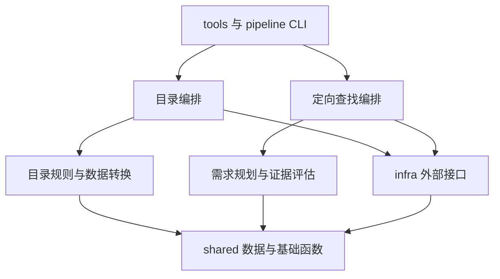

# src 分层与轻量化评估

> 本文保留修复前的分析与基准。2026-09-23 后续实施结果见 [分层重构修复验收](./audit/2026-09-23-分层重构修复验收.md)，不要将下文历史缺口直接视为当前代码状态。

初评日期：2026-09-22；深化完成日期：2026-09-23。当前代码基准：`add38439de4bfa50c7a95fa46fcb711b4b82970c`。开始深化时已有 `public/data/find-report.json` 本地修改，本轮不覆盖该文件。原评估基准为 `361cd08`；旧审查目录不可用，其测试结论不作为本次验证结果。

本轮交付是源码分析、可在仓库内重跑的离线探针与架构决策。没有实施业务重构、调用真实模型、运行真实网络采集或发布页面。此前暂缓的问题不逐条展开；涉及材料身份、状态所有权和保存边界的缺陷纳入本次架构分析。

**结论：采用按业务分包的模块化单体，在每个业务内分开纯规则、编排和持久化。保留 Python、JSON、静态页面与函数式调用。重构的核心是让材料、评估、条目和运行记录各有明确的身份、修改者与恢复规则；目录分层只是实现手段。**

本版优先阅读第 10～15 节：给出可测量的质量场景、方案取舍、七项新增探针、数据契约、故障恢复和验收标准。第 1～8 节保留具体代码拆分依据，并按深化结论修订；[实施方案](./src分层重构实施方案.md) 的修订说明与本版一致。

## 1. 当前规模与判断依据

| 检查项 | 当前结果 | 维护含义 |
| --- | --- | --- |
| `src` | 21 个 Python 文件，6,865 行，含空行、注释 | 比上次审查基准的 5,528 行增加 1,337 行 |
| `pipeline.py` | 1,269 行 | 配置、队列、业务状态、两阶段任务、落盘、CLI 共处一处 |
| `local_run.py` | 618 行；`_collect()` 397 行 | 最长函数，同时修改多个运行状态 |
| `skill_finder.py` | 728 行；`execute_find_skill()` 262 行 | 新功能已出现同样的编排膨胀 |
| `find_evaluate.py` | 588 行 | 规划、Prompt、解析、证据与排序集中；较长，但比编排文件内聚 |
| 另外两个较大文件 | `discover.py` 504 行；`evaluate.py` 435 行 | 都混合了可共享的外部通信和目录专用逻辑 |
| 页面 | `public/index.html` 1,177 行，内联脚本 1,019 行 | 定向结果渲染继续加入同一全局状态闭包 |
| 直接运行依赖 | `requests`、`PyYAML` | 暂无增加框架或运行服务的必要 |
| 数据体积 | 主索引 164,517 字节；页面目录 125,049 字节 | JSON 存储仍然适合当前规模 |
| 原有测试 | 深化前重跑 235 项：234 通过，1 项文档链接失败 | 尚无 `test_skill_finder.py` 和 `test_find_evaluate.py`；测试总数不代表查找链路已覆盖 |
| 静态依赖检查 | 当前 `src` 相对导入图未发现环 | 主要问题是职责归属与修改传播范围 |

行数是定位线索。`_collect()` 虽然所在文件小于 `pipeline.py`，却是更集中的修改热点。`find_evaluate.py` 包含较多 Prompt 和说明文字，不能仅因 588 行就按相同行数切块。

当前应保留：简单 Python 函数、数据类、JSON 持久化、静态页面、现有 CLI、模型响应与业务决策分离、可替换的网络和模型调用。没有证据支持引入数据库、Web 后端、任务队列、依赖注入框架或通用工作流引擎。

## 2. 已出现的架构问题

### 2.1 本地采集依赖另一个完整任务的编排模块

local_run.py:21 从 `pipeline.py` 导入 `load_all_config`、`precheck`、`admission_decision`、`review_state`。

这些分别属于配置和条目更新规则。它们应由两种目录任务共同使用。现在修改配置或复核规则要进入 Actions 编排文件；把 `pipeline.py` 搬进一个新文件夹仍会留下这个问题。静态导入分析显示本地入口直接依赖 15 个内部模块，传递可达 17 个；问题不只是单文件长。

同一条目的更新又分别出现在本地 `publish()` 和 Actions 的 `entry_for()`：前者位于 local_run.py:198，后者位于 pipeline.py:1015。新字段要同步维护两处分支。

建议抽出目录专用的纯函数 `update_entry()`，集中处理版本、评估结果、人工配置投影和待复核状态。调用者负责账本、循环、网络和写文件。旧行为中的争议与已知问题应分别写成回归用例后修正，避免搬迁时无说明地改变业务。

### 2.2 外部接口藏在目录模块中，新功能难以正确复用

evaluate.py:190 的 `call_model()` 是通用模型传输，但同文件包含目录六项检查的 Prompt、分类解析和评估 ID。定向查找只需要传输，却必须导入整个目录评估模块。

discover.py:114 同时包含 GitHub 搜索、认证、仓库树读取，以及目录搜索模板、种子来源和展开策略。新增 skill_finder.py:138 又实现了一次 GitHub 仓库搜索：现有版本包含有界重试，新版本只有一次 `get()`，`sleep` 参数未用于重试。

应把 GitHub 认证、请求、结果解析、树完整性检查放入 `infra/github.py`；把目录查询与种子规则保留在 `catalog/discovery.py`，把需求查询和轮转策略保留在 `finder/search.py`。基础接口接受明确的查询字符串，不能默认附加目录排除词。

**定向查找跳过目录规则是固定要求。分层后 `finder` 不得直接或间接依赖目录分类、预筛、黑名单、冷冻和周配额。**

### 2.3 文件写入借用周预算模块，保存报告又承担页面输出

pool.py:21 和 skill_finder.py:26 导入 `budget._write_json_atomic`、`now_local`。候选池或查找报告的存储没有周配额含义，跨模块借用下划线函数也说明公共接口尚未放在合适的位置。

skill_finder.py:394 的 `save_current_report()` 同时保存本地 JSON、Markdown 和 `public/data/find-report.json`。运行开始就会写入公共页面数据路径，页面写入异常则被吞掉。

前端展示查找结果可以保留，但应明确拆成“本地运行记录”和“页面投影”两步。页面投影只包含展示字段，不直接复制本地绝对路径等运行信息。由编排层选择何时更新，写入失败要有可见诊断。当前代码能证明会写本地 `public/`，不能据此声称已经自动发布到远端。

提取 `infra/files.py` 的原子 JSON/文本写入函数；时间辅助放在中性模块。对于多个进程共享的页面快照，临时文件名应唯一。原子替换负责避免半文件，调用方另行处理并发覆盖顺序。

### 2.4 配置、维护命令与数据转换混在一起

配置加载分散于 `pipeline.load_all_config()`、`prescreen.load_config()`、`discover.load_searches()` 和定向查找的两个配置函数。`local_run.main()` 同时分派采集、离线配置同步与离线增强。

index.py:337 的 `sync_config_to_catalog()` 已经是一条完整维护任务；enrich.py:191 的 `enrich_catalog()` 同样负责读、改、写索引。

建议把目录配置组合放到 `catalog/config.py`，两个维护流程放到 `catalog/maintenance.py`。`index.py` 保留条目、目录和页面数据转换；`enrich.py` 保留单条结构化提取。模型连接文件可共用读取能力，但目录配置和查找配置分别校验、分别组合。

## 3. 新增功能中已复现的行为问题

以下是原评估记录的七类问题，本次核对了相应源码分支。原探针文件位于另一台机器，不能将这些历史复现冒充本轮重新执行；本轮实际重跑的七项探针见第 11 节及仓库内结果文件。这些是拆分时需要保护或修复的边界，并非真实服务商调用结果。

### 3.1 P1：未知用量和请求超时后仍继续调用模型

位置：规划调用后的处理、候选调用后的处理、用量累计。

`UsageTotals` 正确记录 `unknown_usage_requests`，但查找编排只检查已知 `total_tokens`，没有根据未知用量停止。

复现：规划响应缺少 usage，随后仍完成 2 次候选评估；某次评估超时、用量未知后，下一个候选仍被调用。最终可能显示 `completed / target_reached`。

建议在查找流程中统一一次模型调用的记账出口：记录调用结果、更新已知/未知用量、持久化，再决定是否允许下一次调用。规划也使用这一出口。实际用量未知时停止后续模型请求，保留已有有效结果。三种任务的额度策略可以不同，但未知用量的事实不能被忽略。

### 3.2 P1：评估上限约束的是成功结果数量

位置：skill_finder.py:491。

上限使用 `len(evaluated_items)`，解析失败和请求失败不增加这个数量。复现将 `max_evaluations=2`，返回一次无效 JSON、两次有效结果，实际发起了 **3 次候选评估请求**，加上规划共 4 次模型调用。

应区分候选评估尝试数、成功评估数、模型请求数。候选开始调用前占用本轮评估名额，失败仍占名额；`limit` 只控制展示。不要把原本清晰的上限参数悄悄改成“成功结果目标”。

### 3.3 P1：部分引文匹配仍可被标为有效证据

位置：find_evaluate.py:384。

当前允许路径后缀匹配、全文匹配，以及引文前 20 个或后 20 个字符匹配。校验通过后继续保留模型给出的原路径和行号。

复现：真实材料只有 `SKILL.md`，模型引用 `nonexistent/SKILL.md`、第 99,999 行，引文包含真实句子和捏造的“所有测试均为 100%”保证，最后仍是 `supported / strong`。

应使用已读材料的精确规范路径、有效行号和完整引文校验。若容忍模型数错行号，必须找到完整引文并返回程序定位后的路径、起止行；无法可靠定位就降为 `unknown`。代码只能证明引文存在，不能仅凭子串相同证明引文支持某个能力，也不能宣称因此消除了模型幻觉。

### 3.4 P2：失败、中断和无匹配没有统一收尾

位置：无仓库分支、正常排序、中断处理。

复现两种情况：

- 全部 GitHub 查询返回 HTTP 429，结果被标为 `completed / candidates_exhausted`，用户难以区分检索失败与没有候选。
- 已有 1 条有效评估后中断，JSON 中 `evaluations` 保留该条，但短名单仍为空，Markdown/前端不能正常展示它；状态为 `completed`，CLI 还会返回成功退出码。

建议一个 `finalize_run()` 在正常、预算停止、错误和中断路径统一执行：基于已有评估重新排名、设置明确状态、保存报告。分别记录结束状态和匹配数量。每次失败和跳过要进入运行记录，不能只 `print()` 后消失。

### 3.5 P2：材料入口尚未形成完整契约

位置：仓库文件名判断、原文抓取。

复现：`NOT_SKILL.md` 被 `.endswith("SKILL.md")` 当作技能；HTTP 成功且内容为登录 HTML 的材料仍返回 `ok=True`。这只能证明材料会被接受进入后续流程，不能推断它一定被模型推荐。

应精确判断路径 basename；原文抓取返回同一份文本、路径、指纹、读取时间和可确认的版本。明确拒绝空文本、HTML 和截断材料。引用文档也应各自记录指纹与来源。HTTP 层负责读取，调用边界负责“这是可评估的 Skill 材料”的约束。

### 3.6 P2：候选覆盖与需求标准会被隐式改变

位置：查询循环、文件轮转、规划解析。

复现：规划有两个查询，第一个返回 20 个仓库后，第二个完全不执行。随后各仓库路径按字典顺序取前 10 个，未结合需求安排顺序，合集内名称靠后的相关技能容易失去读取机会。

另一个复现：规划仅给出 `quality_signal` 时，解析器自动把第一项提升为 `required`。质量观察项可能被变成用户没有提出的硬条件。

应先收集有界查询结果，再跨查询轮转安排仓库；仓库内使用需求相关性排序并保留通用路径的机会，截断与未读范围写入报告。规划缺少有效必需标准时明确返回规划错误，不能由解析器随意提升质量项。必需条件的语义仍需由明确的需求约束和评估用例验证。

### 3.7 P2：配置错误被静默降级为默认值

位置：配置读取、数值解析、CLI 参数。

无效 JSON 被转为默认值，非法数值字符串也直接回退。复现 `20m` 和 `oops` 均得到 `200000`。当前实际配置为 `"20 000 000"`，可以解析成 20,000,000；原运行说明混淆了配置值与 200,000 的代码兜底值，已在本次文档整理中更正，源码参数校验仍待修复。

应一次解析、一次校验，得到本次生效配置后再创建输出目录。缺少可选文件可用默认值，存在但损坏的文件应报错。数值格式要明确支持或拒绝，CLI 非法值使用参数错误退出。报告保存生效参数；文档注明配置文件默认值与代码兜底值的区别。

## 4. 建议的 src 结构

采用“按业务分包，再隔离外部接口”的结构。日常增加查找功能主要修改 `finder`，目录规则主要修改 `catalog`。

```text
tools/
  run_local.py             # 现有命令、参数与退出码
  find_skill.py            # 现有命令、交互输入与退出码
src/
  __init__.py
  pipeline.py             # 保留 python -m src.pipeline 的薄 CLI
  shared/
    models.py             # 中性 Skill 身份、材料等值对象；旧 Candidate 通过边界适配
    identity.py           # 技能 ID、URL 解析、内容指纹；不含目录线索合并
    materials.py          # 材料集合身份、路径规范与完整性校验；纯函数
    schema.py             # 已共用的字段规范化
    usage.py              # 模型实际用量的事实累计
    runtime.py            # 时钟、时区等小型运行辅助
  infra/
    http.py               # 有界文本读取、网络结果
    github.py             # 认证、仓库搜索、仓库树读取
    llm.py                # API Key、ModelCallResult、单次模型通信
    files.py              # 原子读写、必要的文件锁原语；不决定业务保存顺序
  catalog/
    config.py             # 目录配置加载、组合和预检
    discovery.py          # 种子来源、目录查询、候选发现策略
    evaluation.py         # 六项检查 Prompt、解析、评估 ID
    prescreen.py          # 目录预筛与 PrescreenResult
    decide.py             # 目录准入决策
    overrides.py          # 人工干预规则
    snooze.py             # 冷冻规则
    enrich.py             # 单条离线增强
    entry_state.py        # 统一条目更新、评估继承、复核快照
    index.py              # 条目、目录、页面投影和计数
    store.py              # 目录读写、锁范围、主索引与派生页面的保存协调
    queue.py              # Actions 队列、排序、结清规则与序列化
    budget.py             # 周配额及评估记录
    pool.py               # 本地候选池
    report.py             # 周报和本地采集报告
    sync_reserve.py       # 准备与预留阶段；包含 dry-run 组合
    sync_evaluate.py      # 评估预留项、合并与输出阶段
    local.py              # 本地推荐目标与 Token 预算编排
    maintenance.py        # 离线配置同步、离线增强任务
  finder/
    config.py             # 查找配置与参数校验
    search.py             # 定向查询、轮转、材料准备
    plan.py               # 需求规划 Prompt 和解析
    evaluation.py         # 单技能评估 Prompt、解析、排名
    evidence.py           # 路径/行号/完整引文核验；返回新结果，不修改输入
    run.py                # 查找编排、用量停止、统一收尾
    report.py             # 本地报告、页面投影和渲染
```

树中省略各包的空 `__init__.py`。这是职责归属图，可分批迁移；不要为了凑齐目录创建空业务模块。`materials.py` 有两个业务调用者且承担版本一致性；`evidence.py` 有独立核验不变量；`store.py` 服务采集与维护多个写入入口，均有实际拆分依据。小型辅助函数可先留在其所有者模块，不以文件数验收。相较现在会增加文件数，但不增加运行依赖、常驻进程或新的存储系统。

规则：

1. `tools` 和 `src.pipeline` 负责参数与入口，导入业务用例；业务包不反向导入 CLI。
2. `catalog` 和 `finder` 互不导入。共同需要的事实或通信能力才进入 `shared` / `infra`。
3. `infra` 可使用 `shared` 数据，但不得导入目录规则、查找 Prompt、业务编排或页面渲染。
4. `shared` 不导入其余三个包；也不加载业务配置。`PrescreenResult` 是目录概念，不必继续放在共享模型中。
5. 同一业务包内，编排调用规则与转换函数，并调用业务存储协调器；纯规则模块不读文件、不请求网络、不导入编排。`catalog.store` 不调用 `maintenance`、`local` 或同步阶段。
6. 各包 `__init__.py` 保持简单，避免为了方便导出把整个目录流水线隐式加载进查找入口。



不建立万能 `BaseRunner`，不把周配额、本地推荐目标、定向短名单合并为带大量开关的运行器。也不为每个函数增加接口类、仓储类和服务类；现有函数参数和少量数据类已经足够。

## 5. 大文件具体怎么拆

### 5.1 pipeline.py：按状态边界拆出六组职责

| 当前函数/代码 | 目标位置 | 处理方式 |
| --- | --- | --- |
| `load_all_config`、`precheck`，89 行起 | `catalog/config.py` | 配置只在入口组合；同步预筛配置的读取职责 |
| `_ordered_pending`、`_accumulate_plan`、队列读写、结清判断 | `catalog/queue.py` | 保持“待办、已预留、已结清”的含义一致 |
| `previous_evaluation_snapshot`、`review_state`、`admission_decision`，754 行起 | `catalog/entry_state.py` | 与两套条目构建分支一起收敛 |
| `prepare`、`phase_reserve`、`dry_run` | `catalog/sync_reserve.py` | 保留发现、准备、预留的真实阶段边界 |
| `phase_evaluate`，862 行起 | `catalog/sync_evaluate.py` | 复用条目更新、存储和报告；逐项调用与合并输出分开 |
| `main`，1209 行起 | 薄 `src/pipeline.py` | 保留参数、JSON 输出与现有命令 |

重点处理 `phase_evaluate()` 中嵌套的 `entry_for()`；仅把整个 293 行函数原样搬到另一个文件，仍会留下重复条目规则。

### 5.2 local_run.py：先处理 397 行的 _collect()

`_collect()` 当前内部有 `save()`、`publish()`，同时持有 entries、ledger、pool、usage、report、dirty 等可变状态。

具体拆法：

1. CLI 和两个离线分支交给入口及 `maintenance.py`。
2. `save()` 中的报告计算/渲染移至 `catalog/report.py`，写入调用公共文件函数。
3. `publish()` 中条目事实判断交给 `entry_state.update_entry()`，由编排收集更新后的条目。
4. 将候选处理按“判断是否需要处理 → 读取材料/复用缓存 → 有界评估 → 应用结果”拆成包内函数。参数传必要数据，不让辅助函数通过外层闭包任意修改全部状态。
5. 主循环保留池补充、推荐目标、预算和重试次序。仅在参数传递确实混乱时引入一个明确的本地运行数据类，不增加全局单例或通用上下文服务。

### 5.3 skill_finder.py：分开计划、执行状态和展示

当前配置约 60 行、搜索与材料准备约 170 行、主流程 262 行、Markdown 渲染 84 行、CLI 42 行，职责边界已足够明确。

- `config.py` 产出校验后的生效参数，供程序入口和 CLI 共用，避免两处重复默认值解析。
- `search.py` 管理查询覆盖、文件轮转、材料读取结果；使用共享 GitHub/HTTP 接口。
- `run.py` 管理运行状态；保存 `evaluation_attempts`、有效评估、失败/跳过记录、usage、停止原因。
- `report.py` 从运行状态生成快照与页面数据；写报告不能反过来改变业务状态。
- `finalize_run()` 对任意结束原因重建短名单，保持 JSON、Markdown 和前端一致。
- `plan.py` 与 `evaluation.py` 分别承担需求标准和单技能评估，纯证据核验提取至 `evidence.py`。核验修复应有独立行为提交和用例。

长函数拆分后，关键调用顺序要在主流程中可见。避免再造一个拥有所有成员和数十个方法的 `SkillFinder` 大类。

## 6. 边界数据与行为不变量

只引入实际需要跨函数传递的类型。优先明确以下三种数据：

| 数据 | 最小字段 | 不变量 |
| --- | --- | --- |
| 已读材料 | 路径、完整文本、指纹、读取时间、可确认的版本 | 评估与证据核对使用同一份文本；引用文件各有来源 |
| 候选处理结果 | 技能 ID、尝试状态、评估结果或失败原因、用量 | 失败也是结果；成功数量不能替代尝试数量 |
| 运行快照 | 生效参数、已完成结果、失败/跳过、计数、usage、状态 | 页面/Markdown 是投影；不能重新解释业务结论 |

适合 `dataclass` 或小范围 `TypedDict`，不要求把现有全部 JSON 包装成类。序列化集中在明确边界；保持现有目录、队列和账本文件格式，架构搬迁本身不应导致数据迁移。

业务差异保留：Actions 先预留并推送再评估；本地采集按新增推荐目标和预算运行；定向查找按用户需求和尝试上限运行。共享实际用量统计和通信能力，各自定义停止策略。

## 7. 前端与发布边界

本轮不重做 UI。后端分层时，应把“页面读取何种报告”作为公开契约一起维护。

新增 [renderFindView()](../public/index.html:730) 和目录卡片渲染继续挤在内联脚本。下一步可拆为原生 JS 模块：

- `catalog-state.js`：人工操作、分区、草稿和导出对象等纯状态规则。
- `catalog-view.js`：目录卡片、列表和弹窗。
- `find-view.js`：定向报告的独立渲染。
- `app.js`：数据读取、DOM 事件和存储协调。

现有 HTTP 预览/Pages 方式可继续使用，不增加前端框架和构建链。迁移时保留 CSS 与 DOM 契约，使用 Node 内置测试验证纯状态，再做少量浏览器交互验收。

当前目录数据与查找报告都位于 `public/data/`，部署上传整个 `public/`。页面报告生成与部署属于不同步骤，文档必须说明产物如何进入部署；本地查找输出的公共投影不等于已经上线。本轮不重新评估此前暂缓的工作流问题。

## 8. 实施顺序、验证与停止标准

建议分成可单独审查的批次，行为修复与文件搬迁分别提交，避免难以定位回归。

| 批次 | 工作 | 验收证据 |
| --- | --- | --- |
| 1 | 将本轮离线复现整理为真实入口回归；修正查找的用量、次数、证据、收尾问题 | 失败也占评估名额；未知用量停止；伪造证据不能强匹配；中断仍有可用短名单 |
| 2 | 提取 `shared` 和 `infra`；目录/查找分别调用 | GitHub 请求与模型通信各有一份实现；文件工具不依赖周账本；无新增运行依赖 |
| 3 | 拆 `pipeline.py`，建立共享条目更新，拆本地长函数 | 本地不导入 Actions 编排；相同版本与评估事件得到一致条目更新；两阶段预留契约保留 |
| 4 | 迁移 finder 并拆配置、报告、统一收尾 | `finder` 不导入 `catalog`；有效目录规则缺失或含排除项均不拦截定向需求；页面输出仍可使用 |
| 5 | 同步 CLI、脚本、工作流导入、IDE 与文档；按需拆前端 | 现有命令仍可运行；帮助与默认值一致；页面交互正常 |

行为测试应输入假 API 结果调用生产入口，不在测试里复制循环、计数、继承或排序规则。保留现有测试价值，同时更新其导入与 `patch` 位置；移动模块后，补丁必须落在生产代码实际查找依赖的位置。

必要测试范围：

1. 三种入口：正常、无候选、部分失败、预算停止；查找额外覆盖规划失败与中断。
2. 目录独立规则与查找隔离；查找不改目录主索引、池、周账本和人工配置。
3. 材料精确文件名、空/HTML/截断拒绝、引用路径与指纹、完整引文和定位。
4. 成功/失败评估次数、规划用量、未知用量停止；输出状态与退出码对应。
5. 条目更新由一个生产函数执行，两种目录入口都通过它；新旧数据格式兼容。
6. JSON、Markdown、页面投影来自同一运行快照；原子写失败和中断保留可恢复记录。
7. 使用标准库 AST 检查少量架构约束：业务包互不依赖、infra/shared 不反向导入业务、CLI 不被业务导入。检查相对导入与 `from src...` 两种写法，避免规则被导入形式绕过。

重构后的验证命令示例（新增测试文件目前尚不存在）：

```powershell
.\.venv\Scripts\python.exe -m unittest discover -s tests -q
.\.venv\Scripts\python.exe tools/run_local.py --help
.\.venv\Scripts\python.exe tools/find_skill.py --help
.\.venv\Scripts\python.exe -m src.pipeline --help
```

验收不设置僵硬的全局行数门槛。可把编排函数 100～150 行、普通模块 200～400 行作为检查提示；超过时先看是否跨越多个状态/副作用边界。Prompt、声明式表格和内聚的算法可以例外。最终标准是新增一项需求不再同时修改多个入口的同一条规则，入口足够清楚，运行依赖与数据结构保持轻量。

## 9. 本轮实际验证与交付范围

深化前执行现有测试：**235 项，234 通过，1 项失败**；失败项为 `test_all_local_links_resolve`，原因是本文原来引用另一台机器的三个绝对路径文件。本版移除这些不可复核的链接，改用仓库内证据。文档修订后的测试结果见本文末尾。

本轮证据：

- [静态分析与离线探针](../tools/architecture_audit.py)：网络调用被显式禁止，文件故障及流水线实验使用临时目录；仅读取列出的公开配置，不读取 `*.local.json`。
- [测量与探针结果](./evidence/architecture-audit.json)：包含源码文件 SHA-256、导入边、函数跨度、分支计数、测试方法数及 A1～A7 观察值。

复现命令：

```powershell
.\.venv\Scripts\python.exe tools/architecture_audit.py --output docs/evidence/architecture-audit.json
.\.venv\Scripts\python.exe -m unittest discover -s tests -q
```

审查工具是当前代码的诊断，不是“存在缺陷才通过”的长期回归测试。修复时应把对应案例改成业务测试，断言期望行为，再更新审查快照。它不读取真实运行目录，不写主索引、页面数据或账本。

本轮未测量真实搜索召回率、服务商账单、并发性能、断电持久性或浏览器交互；静态导入统计不能替代运行时覆盖率。后文分别标注源码事实、离线观察和设计建议。

## 10. 用质量场景选择架构，而不以文件数量打分

### 10.1 决策顺序

本项目首先需要评估身份正确、付费请求可追踪、现有数据可恢复，其次才是扩展方便和代码长度。若“减少几个模块”与“同一结论可以追溯到同一材料”冲突，优先后者。这是本项目的设计优先级，不是经过用户实验得出的通用权重。

| 场景 | 期望响应 | 可执行验收 |
| --- | --- | --- |
| 修改目录准入或字段继承规则 | 本地与 Actions 得到相同结果，finder 不受目录规则影响 | 相同规范事件输入两条入口，条目相同；finder 在缺少目录配置的临时根目录运行 |
| 给查找增加一项证据检查 | 只涉及 finder 规则、必要的报告契约和测试 | 不修改目录预算、维护、队列模块；查找纯函数测试无文件或网络操作 |
| 模型调用超时或进程中断 | 已开始的调用保留不确定状态，已有结果可展示 | 后续调用数为 0（finder 策略）；重跑不自动把不确定调用当成未发生 |
| reserve 后上游发生变化 | 旧预留不能用于新材料 | 指纹不匹配时评估调用数为 0，旧预留保留，新版本重新排队 |
| JSON 保存成功但页面写失败 | 已获得的结论可恢复，不重新付费 | 仅凭主记录重建派生文件；错误可见；恢复模型调用数为 0 |
| 本地采集与离线配置同步重叠 | 不因旧内存快照覆盖新人工配置 | 同根目录锁冲突明确返回；不能只在最后 replace 时上锁 |
| 增加展示字段 | 展示转换不改写已有评估结论 | 旧报告仍能读取；转换前后输入深比较相等；未知 schema 有可见提示 |

“只修改一个文件”不适合作为硬指标：新公开字段合理地需要生产者、消费者与测试一起更新。应检查是否为了同一业务规则重复修改多个实现。

### 10.2 可选方案与取舍

| 方案 | 收益 | 代价及本项目结论 |
| --- | --- | --- |
| 保持扁平，只拆几个长函数 | 迁移小，适合紧急修复 | 本地依赖完整 pipeline、finder 借目录通信的问题仍易复发；用于第一批修复，不作为最终边界 |
| 按技术统一分 `services/models/repositories` | I/O 集中，命名统一 | 同一目录规则分散在横向目录，两个业务容易共享错误的策略；不采用全局技术分层 |
| 按业务分包，包内隔离纯规则与副作用 | 两个业务独立演进，共用材料与外部通信 | 需要约束 shared 的增长与包内依赖；**采用**，普通函数和少量数据类即可 |
| 每层定义接口、仓储、用例类的完整端口适配架构 | 外部实现替换点明确 | 当前只有一个文件存储和一类模型传输，逐层接口会增加导航成本；只在实际外部边界使用可注入函数 |
| 数据库、任务服务或多进程工作流 | 可支撑跨主机并发和复杂查询 | 当前没有测量证据支持运维代价；暂不引入，触发条件见第 15 节 |

这不是用主观分数算出的“最优架构”。选择依据是上述场景能否被小规模改动和可执行测试满足；后续有新负载或协作方式时重新决策。

## 11. 深化测量与新增离线证据

### 11.1 复杂度集中在状态编排

AST 测得 `src` 仍为 21 个文件、6,865 行。函数跨度包含嵌套定义；分支计数只计该函数自身的 if、循环、异常分支、推导式与布尔分支，不重复计嵌套函数。该数值用于定位，**不是标准 McCabe 圈复杂度，也不是质量评分**。

| 函数 | 跨度 | 分支计数 | 架构含义 |
| --- | ---: | ---: | --- |
| `local_run._collect` | 397 行 | 79 | 同时维护条目、池、请求、账本和报告；优先减少共享可变状态 |
| `pipeline.phase_evaluate` | 293 行 | 48 | 请求处理与条目合并/发布纠缠；应按状态提交边界拆 |
| `skill_finder.execute_find_skill` | 262 行 | 30 | 配置、检索、评估与多出口收尾混合 |
| `pipeline.prepare` | 153 行 | 35 | 发现策略与队列/预算准备交叉，不能直接归为 HTTP 基础设施 |

`local_run`、`pipeline`、`skill_finder` 的直接内部依赖分别为 15、12、8；传递依赖分别为 17、13、10。图中未发现静态环。finder 会经 `evaluate` 导入 `decide`，这是代码加载耦合；**不能由此断言定向查找已经执行目录准入规则**。

`models` 被 8 个内部模块直接导入，说明改共享结构需要谨慎；不意味着应再加一个模型层。近期 `4bee852` 的结构化摘要字段变更同时涉及两条目录编排，与源码中的两套继承分支相互印证，但没有足够历史样本计算可靠的缺陷率或变更耦合趋势。

### 11.2 七项探针及解释边界

| 编号 | 当前观察 | 对架构的要求 |
| --- | --- | --- |
| A1 | UsageTotals.add 收到 `ModelCallResult(attempts=0)` 仍累计 1 次请求、1 次未知用量 | 区分“未发出”“已开始但结果未知”“响应已收到”，不能从缺 usage 推断请求发生 |
| A2 | 证据核验 修改输入的 explanation 和 limitations；重复调用原输入追加两条限制 | 纯核验返回新对象；保留原模型输出与程序校验结果的区别 |
| A3 | 材料读取 中只改变引用文档时 candidate 指纹不变；指定版本的主文件仍配上 HEAD 引用文档 | 建立材料集合身份，尽可能固定同一 revision；无法固定时标明一致性未知 |
| A4 | evaluation_id 在修改 model 名称但不改 `model_config_version` 时不变 | 当前缓存依赖人工升版本；需要显式版本管理与审计摘要，不可误称自动识别配置变化 |
| A5 | BudgetLedger.load 跨周时移动账本到 history | 名为 load 的操作实际改变磁盘；将读取与周切换命令分开，明确锁和异常责任 |
| A6 | 对 write_catalog 注入页面写失败，主索引已变为 new，页面仍是 old | 多文件不是事务；声明主记录、派生记录和重建步骤，不将单文件原子写包装成完整一致性 |
| A7 | reserve 后移除临时材料，再抓到新文本，phase_evaluate 仍调用评估器并带旧指纹 | 在调用前校验材料与预留身份；这属于正确性修复，不能仅迁移文件 |

A1 是直接边界输入探针，不证明当前每个入口都会在无请求时计费。A3 证明“存在混用版本的构造路径”，没有访问真实 GitHub 判断分支实际差异。A4 在现有“版本由配置维护者提升”的契约下属于失效风险，而非证明服务商已返回错误缓存。A6 注入的是第二个文件写入失败，没有做断电实验。A7 运行真实预留/评估编排、队列和账本，以替身截取评估器收到的材料，不调用真实模型。

### 11.3 按影响安排，不把发现全塞进一次重构

先修第 3 节的用量停止、尝试计数、证据核验，以及 A7 的旧身份绑定新文本；这些直接影响成本边界和推荐可信度。A2 在抽取核验函数时修，A5 在抽取存储时修，A6 的可恢复协议在统一保存入口时落实。A1、A3、A4 先明确契约，再做兼容改造，避免批量改变现有评估 ID 后触发重评。

## 12. 边界如何落到代码和数据上

### 12.1 包名之外，还要定义谁能调用谁

| 所有者 | 负责 | 不应承担 |
| --- | --- | --- |
| `catalog` | 目录准入、人工策略、复核、队列、本地与 Actions 调度、目录存储 | 解释用户定向需求 |
| `finder` | 需求准则、搜索安排、证据核验、匹配排序、查找记录 | 引用目录分类/冷冻/周额度来决定是否评估 |
| `infra` | HTTP、GitHub、模型传输、文件与锁原语；返回可检查结果 | 把 HTTP 200 解释为技能有效，决定是否推荐或是否重试付费任务 |
| `shared` | 跨业务身份、材料值对象、实际用量事实、字段规范化 | 为未来可能复用而容纳目录策略、Prompt、全量 config 或全局上下文 |

`shared` 的准入条件是两个业务已使用同一语义且可以独立测试。当前 `Candidate.domain_hints` 带目录含义，不能把整个旧数据模型原样搬走就称解耦。可先保留旧 JSON 字段，由 catalog 适配到自身的预筛数据；finder 使用中性的 Skill 身份与发现线索。`dedupe()` 中合并领域线索的部分留在 catalog，稳定 ID/通用来源去重才共享。

`fetch_text()` 只返回传输事实；材料路径、完整性和指纹检查由共享纯函数完成，读取范围和遇错策略由业务决定。避免把 `usable_for_recommendation` 这种目录决策名称直接扩散到 infra。模型响应类型可以先留在 `infra.llm`：编排允许依赖它；纯规则只接收已解析内容、usage 值和错误分类，不需要为了一张理想依赖图搬所有类型。

持久化职责放在 `catalog.store`，不放进 `maintenance`。正确调用关系是采集、同步、维护分别调用 store；store 使用 infra 文件原语，必要时调用纯投影函数。`maintenance` 本身是用例，不能成为所有入口的底层公共库。

### 12.2 三类状态分开，避免无意义的笛卡尔组合

| 状态 | 身份及事实 | 修改者 |
| --- | --- | --- |
| 条目 | `skill_id`、当前观察版本、最近有效评估版本、人工选择与待复核状态 | `entry_state.update_entry` 及明确的人工配置投影 |
| 单次评估工作 | `evaluation_id`、预留、尝试次数、结果/失败/未知 | 目录评估记录与调度用例；不能由页面改变 |
| 一次运行 | `run_id`、生效参数、已处理结果、覆盖、用量、停止原因 | 对应编排；报告只读取快照 |

“推荐”不是请求状态，“interrupted”不是条目状态，“没有匹配”不是网络错误。一个失败运行可以包含成功条目，一个保持推荐的条目也可以等待新版本复核。

建议内部用带类型标签的小型事件表示 `fresh_evaluation`、`cached_evaluation`、`observed_change`、`fetch_failed`、`no_evaluation`，而非一个允许任意组合的巨大可选字段字典。每类事件仅携带实际需要的版本、结果、时间。JSON 边界再转换为现有格式；不要求全面上类、继承体系或运行时 schema 库。

`update_entry(previous, event, policy, checked_at)` 应满足：输入不变；同一输入同一输出；同一事件重复应用不重复追加说明；新结论的指纹必须等于被评材料；不存在新结论时不得清空有效旧快照。时间作为显式参数，测试不依赖实际时钟。测试“当前评估时间”和“上游变更时间”不同，不能用一次 now() 填两者。

### 12.3 材料身份需要覆盖模型实际看到的输入

建议把四个概念分开：

1. `SkillRef`：仓库、大小写保真的文件路径、稳定 skill_id；不随内容修改变化。
2. `DocumentSnapshot`：实际读取文本、规范路径、来源 URL、指纹、读取时间、可空的固定 revision。
3. `MaterialBundle`：主文档与引用文档的快照集合、读取失败/省略记录、集合摘要。
4. `EvaluationRecord`：绑定材料摘要、规则/Prompt/模型配置版本和经过校验的结论。

集合摘要可对按规范路径排序的 `{path, fingerprint}` 列表做确定性 JSON 序列化再散列。读取时间不进入摘要，否则每次访问都会失效；缺失的引用记录在 manifest 中，不能在报告中声称已经审查。版本未解析时保留可空值和来源，不能用读取时间冒充提交时间。未来若固定 revision，需要评估附加 API 开销，不在本轮宣称零成本。

指纹基于送给模型和核验器的同一份规范文本，行号也基于该文本计算。旧 `content_fingerprint` 算法和评估 ID 先保持；新增材料摘要作为审计字段和新记录的显式版本契约。材料读取上限继续由 catalog/finder 分别指定。

**兼容策略**：旧结果标记为“仅主文件身份已知”；同规则、同模型版本、同主文件指纹时继续按原策略使用，不伪造引用快照。只有新增严格材料语义的记录使用新版本契约；旧账本的未完成预留先结清或保守停止，不批量改 ID，也不自动重评全部历史条目。

主文件+引用全文只在本次运行或现有临时目录复用；持久报告保存路径、摘要、必要引文和版本。这样可追溯已读证据，但不保证上游删除后还能重跑完整评估，这是不镜像上游内容的明确代价。

### 12.4 复用需要防止同时复用错误策略

本地流程通过 `ledger.cap = reserved_count + len(pool)` 绕开周额度、调用 `_save_record` 调整重试字段，说明 `BudgetLedger` 同时承载“周配额”和“评估尝试记录”。先暴露明确记录操作，移除跨模块私有调用；若两类策略仍互相渗透，再在 `catalog/budget.py` 内分开尝试记录与周额度策略。先可共处一个文件，不需要立刻再加服务层。

三个运行器继续独立：Actions 保守预留并先推送；本地按目标和估算预算重试；finder 未知用量立即停止。可以共享 `UsageTotals` 的事实模型，不能共享一个会偷偷决定重试和额度的万能执行器。

传输负责一次网络尝试和响应解析，重试决策应只有一个所有者。finder 强制一次尝试；本地已有外层重试继续保留；目录原有底层重试在迁移初期保持兼容，单独记录其多尝试事实。以后若统一重试所有权，须作为行为变更单独验收。

## 13. 保存、故障恢复与并发模型

### 13.1 按事实指定主记录

| 数据 | 对什么事实负责 | 派生物/恢复方式 |
| --- | --- | --- |
| 配置中的 overrides/snoozed | 人工意图 | 页面和条目投影不能反写成新评估事实 |
| 评估记录与预算账本 | 已预留/尝试/完成什么，何时允许下一次调用 | 不是页面显示数据；两者部分落盘时保守停止并诊断 |
| `data/catalog.json` | 当前目录条目快照 | 页面 catalog、统计和部分报告由它生成 |
| 队列/本地池 | 调度进度和候选顺序 | 不是推荐结论；已完成结果优先复用，避免重调模型 |
| 本地 finder `report.json` | 当前运行已有事实与结果 | Markdown 和公共 finder 报告可重新生成 |

没有一个“全局唯一真相文件”能同时表达所有这些事实。不同记录间用 ID、版本和写入次序连接；只有页面快照应严格是派生视图。

### 13.2 写入顺序与崩溃窗口

```text
校验配置和材料
  → 保存预留/请求开始记录
  → 发出请求
  → 记录实际用量、结果或不确定状态
  → 保存权威结果
  → 更新条目/队列或运行快照
  → 生成页面与 Markdown
```

Actions 还必须保留已有 reserve → 成功推送 → evaluate 的远端持久化门槛。本图说明本地职责，不证明当前 Git 工作流提供了每次请求的远端持久性。

请求开始记录与远端计费没有共同事务：进程可能在记账后、实际发出前退出。此时只能保守记为结果未知，不能证明已经计费，也不能证明可以免费重试。A1 所要求的“未发出不计请求”限于能确认未进入传输的前置校验失败；不承诺跨崩溃窗口的恰一次调用。

| 失败位置 | 恢复原则 | 禁止的推断 |
| --- | --- | --- |
| 请求前记录保存失败 | 不发请求 | “只是日志失败，可以继续” |
| 已记录开始、未记录响应 | 标记结果未知并保留已有结果 | “没有响应文件所以没有消耗” |
| 评估记录完成、目录未更新 | 从已完成记录重新应用条目事件 | “目录没有条目，所以重新评估” |
| 主索引完成、页面失败（A6） | 离线重建投影，暴露构建诊断 | “原子写意味着两份 JSON 同时成功” |
| 部分 finder 结果后中断 | finalize 根据已完成评估重排并输出部分结果 | “运行中断，所以成功项也不可用” |
| 连本地 JSON 都不能保存 | 尽力输出诊断并返回失败，保留此前成功快照 | “统一 finally 保证任何情况下都保存成功” |

若提供 `rebuild_public`，它只能读取已提交快照，不执行发现或模型调用。现有 `--sync-config` 会应用最新人工配置，不能当作字节级重放；重建展示与同步人工意图应是不同语义，即便最初由同一维护入口分派。

唯一临时文件+原子替换保障单文件不会展示半份内容，不能消除陈旧快照覆盖，也不能保证断电后的持久性。当前验收限定为进程异常和注入 I/O 失败；未来若要求断电持久性，再设计 flush/fsync 及平台验证，不在本轮口头承诺事务。

### 13.3 本地并发先采用简单、可解释的约束

默认目录任务单写者，同一个根目录的采集、配置同步、离线增强使用同一锁。最容易正确实现的是从读主索引、应用变更到提交主索引持有锁；代价是长采集期间维护命令需要等待或退出，须提示具体冲突。仅将原子 replace 包在短锁内不能保护前面的读改写。

本地现有 `data/local/run.lock` 只覆盖本地采集入口，不能自动保护其他写入入口。新锁覆盖范围要用并发用例验证；跨主机 Git push 的冲突仍由工作流处理，文件锁不覆盖它。

若长锁确实影响使用，再引入明确的 catalog revision：锁内读版本 → 锁外获取网络结果 → 锁内重读并按事件合并，版本冲突重算纯条目转换，不能重发付费请求。这个方案比长锁复杂，当前不应无需求地并行实现两种锁模式。

finder 每次有独立运行目录，只在发布共享页面快照时短锁；排序依据按成功发布顺序，报告显示 run_id/topic/updated_at。这不能保证最后启动的任务一定最后显示，产品需要那种语义时再增加显式发布序号。

## 14. 配置、错误与页面契约

配置只在入口解析一次，产出最小、已校验的生效值。密钥/endpoint 属于传输配置；业务规则只拿到领域策略，报告只拿到允许公开的参数。避免把包含认证信息的全量 `cfg` 穿过每个纯函数或保存为运行快照。

模型缓存版本应覆盖规则语义、Prompt、解析/校验器和实际影响输出的模型设置。现有 `model_config_version` 是手工契约，A4 说明它不会自动追踪变化。近期先保留现有 ID，增加非敏感设置摘要和版本不一致诊断；未来改缓存键时单独提供旧记录兼容策略。不能只改摘要算法就令整库重新付费。

建议错误至少包含 `stage`、稳定 `code`、是否重试、请求是否已开始、脱敏 message；不要让调用方解析人类日志决定状态。错误、覆盖不足和没有匹配分别记录。真实服务端响应正文或请求异常可能含连接信息，不因为字段叫 error 就认为可公开；公共投影使用白名单，原始堆栈只供本地诊断。

运行报告的稳定契约包括 `schema_version`、run_id、状态/停止原因、计数、生效参数、usage、来源覆盖、结果和错误。新增字段兼容旧报告；缺失计数应显示未知而非伪造 0；未知 schema 应显示不兼容提示。`schema_version` 描述存储格式，`rules_version` 描述评估语义，两者不能互相替代。

证据存在不代表语义一定支持需求。程序可以精确验证路径、行号和完整原文；模型仍负责关联解释。针对“泛泛提及能力”“只链接文章”“引文含否定语句”等反例评估 Prompt，并将语义判断限制写清。不能沿用“杜绝幻觉”作为系统保证。

查找报告的 public 投影在统一收尾时发布：正常零匹配可覆盖旧主题；错误/中断有有效结果时发布带状态的部分结果；没有有效结果时保留上一次快照并在本地记录原因。页面必须展示报告自己的主题和时间，不能把旧结果冒充刚刚完成的任务。

前端模块化排在数据契约之后。后端必须先产出自洽状态，前端不得根据 shortlist 数量自行重新推断运行成功与否。现有 `test_public.py` 主要验证文本与静态结构，不能证明 JS 可以执行或交互正确；将来改前端至少增加脚本语法与新旧报告行为测试，再做浏览器验收。

## 15. 迁移验证、完成条件与后续演进

### 15.1 调整实施顺序

原 P0～P5 保留，但在 P0 固定可重跑数据与源码摘要；在 P1 同时纳入 A7 的身份保护；在 P2 提取材料纯契约；P3 建立 store 和条目事件；P4 迁移 finder 并修复 A2；P5 验证契约和故障恢复。移动文件与修正行为分开审查，内部导入和实际入口一批迁完。

不要求在第一批完成全部理想类型和新缓存键。先以适配函数保护旧序列化，再缩小可变数据的传播范围，最后移除不再使用的兼容壳。旧报告保留读取能力；未来版本未知时应报错，不能自动按最旧版本解释。

### 15.2 新增验收应能发现“换文件但没改结构”

| 验收 | 必须证明 | 不能替代它的检查 |
| --- | --- | --- |
| 架构导入检查 | catalog/finder 互不导入；纯规则不依赖 I/O 或编排；store 不反向调用用例 | 只看目录名称，或只检查顶层相对 import |
| 条目事件矩阵 | 两个入口同事件同结果；新空值与旧字段缺失有区别；多次失败不丢原评估 | 测试里再写一套 update_entry |
| 纯函数性质 | 输入不变、固定时间下确定性、同事件重复应用稳定 | 仅断言返回值类型 |
| 材料绑定 | 主/引用变更可识别；预留与实读不一致时 0 次评估 | 文件名含 SKILL.md 或 HTTP 200 |
| 请求记账 | 未发出不计请求；已发出未知不能当零；规划与评估尝试分开 | 只比较成功结果数量 |
| 文件故障注入 | 每个提交边界失败后的存活记录、退出状态和离线恢复符合第 13 节 | 仅断言最终文件存在 |
| 隔离与契约 | 临时根目录、旧报告样例、实际 CLI、缺目录配置的 finder 均可验证 | 只测孤立 helper 或字符串包含 |

AST 检查覆盖绝对、相对及函数内导入；动态 import 不在现有审查工具能力内。未来正式门禁应禁用未经说明的动态业务导入，不能把静态工具称作完整架构证明。测试本身尽量注入网络/时钟/存储边界，不 mock 掉正在验证的业务规则。

CI 应检查这些可执行约束；不要求“测试数达到 N”“全仓库每个函数少于 100 行”或未经实测的性能提升比例。分支数、依赖数只作比较信号，关键是规则所有者唯一、错误分支可解释、输入输出可重放。

### 15.3 何时才增加基础设施

| 触发证据 | 下一步 | 当前保持 |
| --- | --- | --- |
| 持续出现长锁妨碍日常操作 | 先测量锁等待，再评估版本比较与事件合并 | 目录单写者 |
| 多个主机必须同时修改同一目录，且无法用 Git/单写者满足 | 重新评估集中存储、事务与权限模型 | JSON + 既有发布链路 |
| 本地加载/全量写盘耗时已影响任务目标，且数据规模可复现 | 测量再选择分片、增量写或 SQLite | 不凭文件行数迁库 |
| 至少第二个存储/模型实现已出现，调用契约相同 | 抽小范围 Protocol 或适配接口 | 注入普通函数 |
| 查找召回/质量需要可比较改进 | 建固定需求集，标注 relevant/must-have，记录覆盖与排序指标 | 不把路径词命中等同于质量 |

运行时性能需分开记录检索、读取、模型等待、解析、保存耗时，以及输入字节数/模型请求数/Token/未读候选数。当前没有阶段耗时样本，所以只能判断结构热点，不能宣称重构会明显加速。固定需求集及标注规则建立后，才讨论召回率和推荐准确率。

### 15.4 本版交付结论

已有事实足以支持按业务边界重构，尚不足以支持换技术栈。比旧方案更关键的改进是：独立存储协调器、材料集合身份、纯条目事件、请求事实与预算策略分离，以及可验证的故障恢复协议。它们都有具体源码或探针依据，不要求引入常驻服务。

本轮只修改评估/实施文档并增加诊断工具与结果；没有修复生产代码。离线审查已运行，七项观察均已记录；修订文档后完整测试 **235 项通过**，`git diff --check` 无空白错误。该结果不等于上述待实施架构已通过验收。
