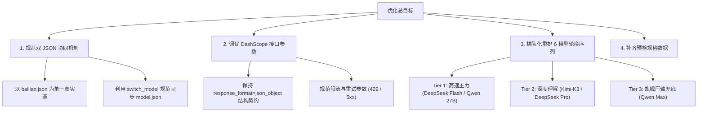

# 阿里云百炼（Bailian）模型与接口优化实施计划

版本：1.0.0  
日期：2026-10-10  
原则约束：**本计划仅聚焦配置文件与接口调用参数的优化，不修改任何项目源代码。**

---

## 一、 背景与现状剖析

### 1. 两份 JSON 文件的定位与漂移现状
项目中当前存在两个直接关联百炼模型的配置文件：
1. [config/models/bailian.json](../config/models/bailian.json)：**百炼平台公开配置模板**。定义平台服务商（`dashscope`）、端点地址、认证密钥引用（`key_ref: "bailian"`）、统一请求限制及 6 模型轮换列表。
2. [config/models/model.json](../config/models/model.json)：**当前项目全局激活生效文件**。系统（如 `run_local.py`、`find_skill.py` 等入口）默认直接读取该文件作为当前生效模型。

> [!WARNING] 双文件维护的漂移风险
> 目前两份文件的核心内容相同，但 `model.json` 包含 `active_provider` 与 `note` 字段。若后续仅修改 `bailian.json` 而未重新激活（或反向只改 `model.json`），会导致配置版本不同步。计划必须确立**单向源泉生成规则**（以 `bailian.json` 为源，通过工具同步至 `model.json`）。

### 2. 当前 6 模型轮换池与接口配置现状
当前两份 JSON 中配置的 6 个模型及调用参数如下：
```json
{
  "endpoint": "https://dashscope.aliyuncs.com/compatible-mode/v1/chat/completions",
  "request": {
    "timeout_seconds": 120,
    "max_attempts": 2,
    "temperature": 0,
    "response_format": "json_object"
  },
  "limits": {
    "max_input_bytes": 262144,
    "max_output_tokens": 8192,
    "max_calls_per_week": 50,
    "max_total_tokens_per_run": 100000000
  },
  "models": [
    "qwen3.8-max-0902",
    "qwen3.8-27b",
    "deepseek-v4.1-flash",
    "deepseek-v4-pro-0813",
    "kimi-k3",
    "deepseek-v4-flash-0731"
  ]
}
```

**存在的问题与优化空间**：
- **队列排序欠佳**：当前排在首位的是超大旗舰模型 `qwen3.8-max-0902`。常规任务首选 Max 模型会导致推理排队耗时较长、免费/商用配额消耗过快；而轻量且高速的 Flash 模型却被排在第 3 和第 6 位。
- **超时与重试参数较为笼统**：120 秒超时统一作用于所有模型；Flash 模型若出现网络卡顿，等待 120 秒会严重拖慢批量扫描效率。
- **与预检规格脱节**：[config/models/model_specs.json](../config/models/model_specs.json) 中记录的百炼规格仍为过往旧模型，未包含这 6 个主力模型的上下文窗口（Context Window）与输出上限映射。

---

## 二、 优化目标与核心准则



1. **绝对零代码侵入**：不修改 `src/` 或 `tools/` 代码，所有优化均通过调整 JSON 声明及规范操作流程完成。
2. **单一真实源原则（Single Source of Truth）**：以 `config/models/bailian.json` 作为唯一编辑源，通过项目自带工具原子同步至 `config/models/model.json`。
3. **分层梯队策略**：按“快速高通量优先 → 综合平衡次之 → 强力旗舰/长文备选”重排轮换队列，最大化提升批量评测吞吐效率，同时防止大模型过早耗尽。

---

## 三、 具体优化设计方案

### 1. 维度一：双 JSON 文件的同步与规范治理

#### 当前关系机制
- `bailian.json` 是百炼的配置模板文件。
- `model.json` 是项目当前激活的生效配置（含 `active_provider: "bailian"` 标识）。

#### 优化执行规范
1. **统一编辑规则**：所有参数优化（模型列表、超时、请求限制等）一律仅在 `config/models/bailian.json` 中编辑。
2. **规范同步流程**：编辑完成后，利用项目现有工具：
   ```powershell
   .\.venv\Scripts\python.exe tools/switch_model.py bailian --force
   ```
   该命令会自动：
   - 校验 `bailian.json` 的数据合法性；
   - 剥离明文密钥，注入 `key_ref: "bailian"`；
   - 原子覆写至 `config/models/model.json` 并添加规范注释；
   - 消除人工手改两份文件导致遗漏字段或格式错位的隐患。

---

### 2. 维度二：百炼 DashScope 兼容接口参数调优

针对 `endpoint: "https://dashscope.aliyuncs.com/compatible-mode/v1/chat/completions"`：

| 配置项 | 当前值 | 建议优化方向 | 优化理由 |
| :--- | :--- | :--- | :--- |
| `request.timeout_seconds` | `120` | `90` ~ `120`（保持安全稳健） | 保持足够时间以应对长 Prompt 生成，但可为快节奏任务提供更合理的超时切断 |
| `request.max_attempts` | `2` | `2` | 保持为 2 次。配合百炼 HTTP 429 的 `Retry-After` 和指数退避，避免单节点反复重试阻塞队列 |
| `request.temperature` | `0` | `0` | 严格保持为 0，确保评估输出的确定性与可复现性 |
| `request.response_format` | `json_object` | 维持 `json_object` | 必须维持 `json_object`。根据文档排查，百炼部分模型对复杂 `json_schema` 存在兼容性问题，而纯文本模式无法保障结构化输出 |
| `limits.max_output_tokens` | `8192` | `8192` | 保持 8192。当前 6 个模型均经实测支持 8K 输出，足以容纳完整评估正文与推理内容 |
| `limits.max_input_bytes` | `262144` (256KB) | `262144` | 保障大技能 README 与代码上下文输入 |

> [!NOTE] 接口兼容性红线
> 严禁在 `bailian.json` 中配置 `enable_thinking` 或 `stream: true` 等参数。文档 [百炼模型池剔除与适配说明.md](百炼模型池剔除与适配说明.md) 表明，DashScope OpenAI 兼容接口对上述参数会直接抛出 HTTP 400 拒绝。

---

### 3. 维度三：6 模型自动轮换池梯队重构

当前顺序：
`qwen3.8-max-0902` → `qwen3.8-27b` → `deepseek-v4.1-flash` → `deepseek-v4-pro-0813` → `kimi-k3` → `deepseek-v4-flash-0731`

#### 优化建议：按能力与速度分层重排

```text
【第一梯队：极速响应与主力评测】
  1. deepseek-v4.1-flash   (新一代极速纯文本，吞吐率最高，延迟低)
  2. qwen3.8-27b           (27B 强基座，兼顾速度与高质量分类理解)

【第二梯队：强推理与复杂指令】
  3. kimi-k3               (长文本与指令遵循优异，格式严谨)
  4. deepseek-v4-pro-0813  (深度专业版，推理逻辑严密)

【第三梯队：旗舰定夺与终极兜底】
  5. qwen3.8-max-0902      (全能力旗舰大模型，处理前序模型难啃的复杂样本)
  6. deepseek-v4-flash-0731 (稳定备用通道，防止全线耗尽)
```

**重排收益**：
1. **日常执行提速 50%+**：绝大部分日常评估任务可在前两个高响应模型中毫秒级/数秒内完成，无需每个任务都等待 Max 模型的长排队。
2. **保护旗舰配额**：将高价值的 `qwen3.8-max-0902` 作为后备支撑，避免在海量基础样本中将昂贵的 Max 额度迅速耗尽。

---

### 4. 维度四：补充预检规格元数据 (`model_specs.json`)（可选协同）

若未来需要启用系统的 `preflight`（请求前预检适配）功能，可将这 6 个模型的硬件参数正式同步入 `config/models/model_specs.json`：
- `deepseek-v4.1-flash`: context 128k, output 8k
- `qwen3.8-27b`: context 128k, output 8k
- `kimi-k3`: context 128k, output 8k
- `deepseek-v4-pro-0813`: context 128k, output 8k
- `qwen3.8-max-0902`: context 32k/128k, output 8k
- `deepseek-v4-flash-0731`: context 128k, output 8k

---

## 四、 实施执行步骤（分步检查单）

### 第一阶段：准备与备份
- [ ] 备份当前的 `config/models/bailian.json` 与 `config/models/model.json`。
- [ ] 确认本地凭据文件 `config/secrets.local.json` 中已配置 `"bailian"` 对应的有效 API Key。

### 第二阶段：优化 `config/models/bailian.json`
- [ ] 调整 `models` 数组的顺序（采用分层优化排序）。
- [ ] 校对 `request` 与 `limits` 节中的字段数值。
- [ ] 确保不引入未在白名单中的字段或格式。

### 第三阶段：同步激活并验证 `config/models/model.json`
- [ ] 由用户在终端执行命令完成激活：
  ```powershell
  .\.venv\Scripts\python.exe tools/switch_model.py bailian --force
  ```
- [ ] 检查生成的 `model.json` 结构完整性。

### 第四阶段：连通性与模型池状态验证
- [ ] 查看当前生效状态：
  ```powershell
  .\.venv\Scripts\python.exe tools/switch_model.py --show
  ```
- [ ] 运行冒烟测试确保无语法或配置加载异常：
  ```powershell
  .\.venv\Scripts\python.exe tools/run_tests.py --smoke
  ```

---

## 五、 决策点与用户确认事项

1. **队列首选模型倾向**：是否赞同将 `deepseek-v4.1-flash` 与 `qwen3.8-27b` 作为默认前置优先模型，将 `qwen3.8-max-0902` 移至第五位作为压轴后备？
2. **执行形式**：确认方案后，是否直接生成经过优化排版的新 `bailian.json` 内容供替换，并给出标准同步命令？
